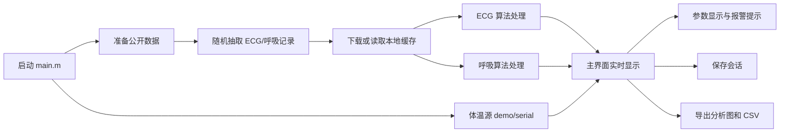

# 项目介绍

## 项目名称

通用型多生理参数监护系统，基于 MATLAB 实现。

## 建设目标

本项目围绕“采集/读取、预处理、特征提取、实时显示、异常提示、结果保存、可视化导出”构建一个多生理参数监护平台。系统同时覆盖心电 ECG、呼吸 Respiration 和体温 Temperature 三类信号：

- ECG：使用 MIT-BIH Arrhythmia Database 公开真实心电数据，完成滤波、R 波检测和心率计算。
- 呼吸：使用 BIDMC PPG and Respiration Dataset 公开真实呼吸数据，完成预处理、自适应增强、呼吸峰检测和呼吸率计算。
- 体温：支持 demo 序列和 Type-C 红外体温传感器串口读取，默认串口为 `COM7`，体温命令为 `0xAB`。

## 系统功能

| 模块 | 主要功能 | 对应源码 |
| --- | --- | --- |
| 主 GUI | 显示 ECG、呼吸、体温曲线，显示心率/呼吸率/体温，保存与导出 | `src/BioMonitorApp.m` |
| 体温独立 UI | 单独连接 Type-C 测温模块，读取原始回包并显示体温曲线 | `temperature_sensor_ui.m`, `src/TemperatureSensorReaderApp.m` |
| 数据下载与解析 | 下载/读取 MIT-BIH 与 BIDMC 数据，生成缓存 | `src/+bioio/` |
| ECG 算法 | 基线校正、FFT 带通、差分包络、自适应阈值、R 波检测 | `src/+bioalg/processEcg.m` |
| 呼吸算法 | 基线去除、FFT 带通、ALE/LMS 自适应增强、峰值检测 | `src/+bioalg/processRespiration.m` |
| 体温数据源 | demo 温度序列和真实串口体温读取 | `src/+tempsrc/TemperatureStream.m` |
| 可视化导出 | 导出处理前后对比图、检测结果图和 CSV 摘要 | `src/+bioout/exportAnalysisReport.m` |

## 总体流程

## 数据来源

| 数据类型 | 数据集 | 用途 |
| --- | --- | --- |
| 心电 ECG | MIT-BIH Arrhythmia Database | 用于真实心电波形、R 波检测、心率计算和心律异常提示 |
| 呼吸 Respiration | BIDMC PPG and Respiration Dataset | 用于真实呼吸波形、呼吸峰检测、呼吸率计算和呼吸节律提示 |
| 体温 Temperature | Type-C 红外体温模块 / demo 序列 | 用于体温实时显示、体温阈值报警、趋势分析 |

## 项目目录

| 路径 | 说明 |
| --- | --- |
| `main.m` | 综合监护平台启动入口 |
| `temperature_sensor_ui.m` | 体温传感器独立 UI 启动入口 |
| `smoke_test.m` | 快速验证算法链路 |
| `export_analysis_report.m` | 一键导出分析图和表格 |
| `src/` | 项目主源码 |
| `data/public/` | 自动下载或已有的公开数据 |
| `data/cache/` | ECG/呼吸算法处理缓存 |
| `output/analysis/` | 导出的分析报告、图片和 CSV |
| `output/sessions/` | 主界面保存的会话数据 |
| `项目文档/` | 本次整理的说明文档 |

## 与题目要求的对应关系

| 题目要求 | 当前实现 |
| --- | --- |
| MATLAB 生理信号采集与预处理 | 通过公开数据读取、体温串口读取、基线校正、带通滤波实现 |
| ECG 数字滤波与差分阈值 R 波检测 | 已在 `processEcg.m` 中实现 |
| 呼吸自适应滤波与呼吸率提取 | 已在 `processRespiration.m` 中实现 ALE/LMS 型自适应增强 |
| 体温信号读取与显示 | 支持 demo 和真实串口读取，体温命令 `0xAB` |
| GUI 综合监护平台 | 已在 `BioMonitorApp.m` 中实现 |
| 数据保存与异常报警 | 支持会话保存、CSV 输出和界面报警文字提示 |
| 可视化与性能验证 | 支持 GUI 实时曲线、导出对比图、检测图、SNR 和统计表 |
