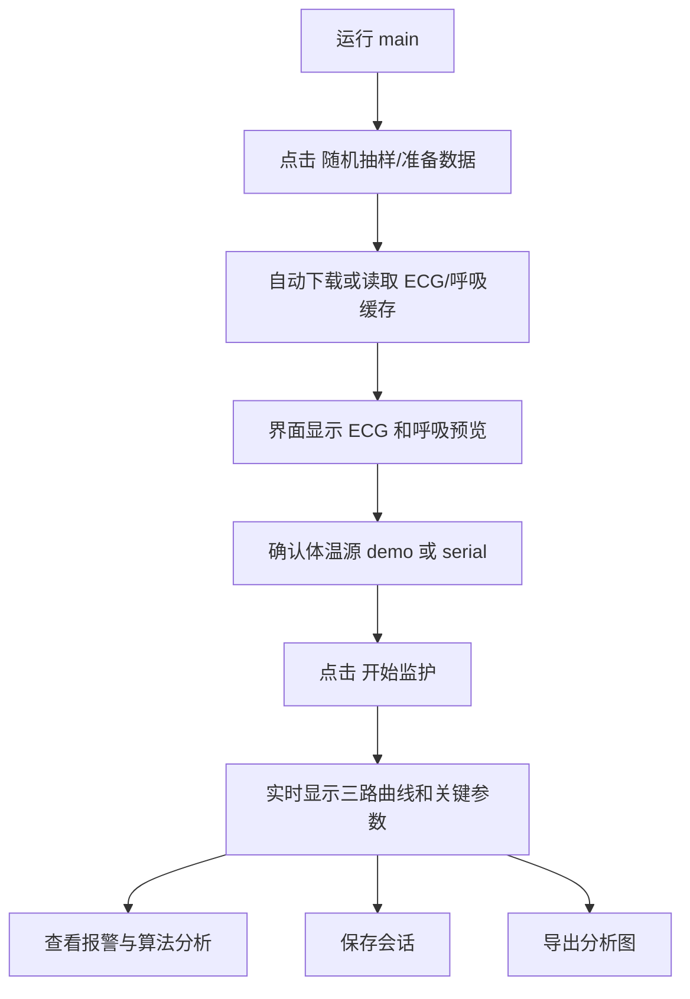

# 运行程序说明

## 1. 运行环境

推荐环境：

- 操作系统：Windows
- 软件：MATLAB R2024a 或兼容版本
- 网络：首次运行公开数据下载时需要联网；如果数据已经在 `data/public/` 中，则可离线运行
- 体温硬件：Type-C 红外体温模块，当前默认串口 `COM7`

项目不要求修改 MATLAB 全局路径。入口文件会在当前 MATLAB 会话中把项目 `src` 目录临时加入路径。

## 2. 启动综合监护主程序

在 MATLAB 当前目录切换到项目根目录：

```matlab
cd('E:\文档\codex项目\MATLAB项目\2026.04.11matlabui1000\2026.04.11matlabui1000')
```

运行：

```matlab
main
```

启动后会出现“通用型多生理参数监护系统”窗口。

## 3. 主程序推荐操作流程



### 第一步：准备数据

点击“随机抽样/准备数据”。

程序会自动：

- 随机抽取 ECG 记录和呼吸记录；
- 检查本地 `data/public/` 是否已有数据；
- 缺失时从 PhysioNet 下载；
- 调用 ECG 和呼吸算法处理数据；
- 将处理结果缓存到 `data/cache/`，下次运行可加快加载。

### 第二步：设置体温源

主界面中“体温源”有两个选项：

| 选项 | 说明 |
| --- | --- |
| `demo` | 使用软件生成的体温占位序列，不需要硬件 |
| `serial` | 从真实 Type-C 体温模块串口读取 |

当前默认体温源为 `serial`，默认端口为 `COM7`，默认波特率为 `9600`。

### 第三步：开始监护

点击“开始监护”后，程序会：

- 按时间推进 ECG 和呼吸波形；
- 周期性读取体温数据；
- 更新心率、呼吸率、体温；
- 在报警框中显示异常提示；
- 在分析框中显示 SNR、峰值数量、心呼相关和体温趋势。

### 第四步：停止、保存、导出

- “停止”：停止当前监护刷新。
- “保存会话”：保存当前体温时间序列、心率、呼吸率和会话信息到 `output/sessions/`。
- “导出分析图”：导出 ECG/呼吸处理前后对比图、峰值检测图和 CSV 表格到 `output/analysis/`。

## 4. 单独运行体温传感器读取界面

如果只想测试体温传感器，不运行综合主界面，使用：

```matlab
temperature_sensor_ui
```

界面默认参数：

| 参数 | 默认值 | 说明 |
| --- | --- | --- |
| 端口 | `COM7` | 当前体温传感器端口 |
| 波特率 | `9600` | Type-C 测温模块常用参数 |
| 模式 | `body` | 体温模式，发送 `0xAB` |
| 体温 HEX | `AB` | 体温读取命令 |
| 物温 HEX | `AA` | 保留的物温读取命令 |
| 等待时间 | `0.50 s` | 发送命令后的回包等待窗口 |

推荐操作：

1. 点击“刷新串口”，确认能看到 `COM7`。
2. 点击“连接”。
3. 点击“读取一次”确认有回包。
4. 需要连续观察时点击“连续读取”。
5. 结束后点击“停止”或“断开”。

## 5. 体温串口协议说明

| 项目 | 内容 |
| --- | --- |
| 串口参数 | `9600, 8, N, 1` |
| 发送格式 | HEX 单字节 |
| 体温命令 | `0xAB` |
| 物温命令 | `0xAA` |
| 接收格式 | ASCII |
| 返回示例 | `+000365` |
| 显示换算 | `365 / 10 = 36.5 °C` |

当前代码对体温数据不做额外补偿或校准，只按传感器返回帧正常读取和显示。

## 6. 快速验证命令

### 验证数据下载、解析和算法链路

```matlab
smoke_test
```

该命令会随机抽取公开数据，运行 ECG/呼吸算法，并用 demo 体温序列验证体温数据源对象。

### 导出分析图和 CSV

```matlab
export_analysis_report
```

也可以指定抽样模式：

```matlab
export_analysis_report("abnormal")
export_analysis_report("mixed")
export_analysis_report("normal")
```

导出结果保存在：

```text
output/analysis/report_时间戳_ecg_记录号_resp_记录号/
```

## 7. 常见问题

### 7.1 主界面没有出现

检查：

- 当前 MATLAB 路径是否在项目根目录；
- 是否直接运行了 `main`；
- MATLAB 命令行是否有报错；
- `src` 文件夹是否存在。

正确方式：

```matlab
cd('项目根目录')
main
```

### 7.2 体温传感器连接失败

检查：

- 设备管理器中是否存在 `COM7`；
- 是否有其他 MATLAB 窗口或串口调试助手占用了 `COM7`；
- CH340 驱动是否正常；
- 波特率是否为 `9600`。

### 7.3 有报警时界面卡顿

当前代码已取消蜂鸣动作，报警只在界面中显示文字。若仍卡顿，优先检查：

- 数据下载是否正在进行；
- 串口是否持续无回包；
- MATLAB 是否被其他重计算任务占用。

### 7.4 体温数值看起来偏高或偏低

当前程序只显示传感器返回值，不额外修正。请确认：

- 模式为 `body`；
- 传感器距离和使用方式符合模块说明；
- 避免直接接触、遮挡或距离过近造成红外测温异常；
- 观察原始回包是否稳定，例如连续返回是否都接近同一范围。
