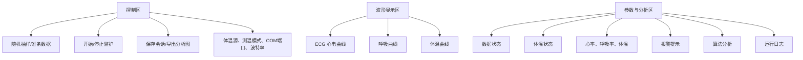

# 界面与输出说明

## 1. 主界面组成

主界面由控制区、三路曲线显示区和参数分析区组成。



## 2. 控制区按钮

| 按钮 | 功能 |
| --- | --- |
| 随机抽样/准备数据 | 随机抽取 ECG/呼吸公开记录，下载缺失文件并运行算法 |
| 开始监护 | 开始实时推进曲线并刷新参数 |
| 停止 | 停止监护刷新 |
| 保存会话 | 保存当前监护数据 |
| 导出分析图 | 导出 ECG/呼吸处理前后对比图和检测图 |
| 刷新串口 | 刷新当前可用 COM 口 |

## 3. 参数显示

| 参数 | 来源 | 计算方式 |
| --- | --- | --- |
| 心率 HR | ECG R 波位置 | `60 / RR间期` |
| 呼吸率 RR | 呼吸峰位置 | `60 / 呼吸周期` |
| 体温 Temp | demo 或串口 | demo 生成或串口回包 `/10` |

## 4. 报警显示

报警只通过文字显示，不发出蜂鸣声。

| 报警类型 | 判断规则 |
| --- | --- |
| 心率报警 | HR 小于 50 bpm 或大于 110 bpm |
| 呼吸报警 | 呼吸率小于 10 bpm 或大于 24 bpm |
| 体温报警 | 体温小于 36.0 °C 或大于 37.3 °C |
| 心电异常提示 | 近 25 秒 RR 间期变异系数较大或最大偏差较大 |
| 呼吸异常提示 | 近 35 秒呼吸周期变异较大，或呼吸率越界 |

## 5. 算法分析区

分析区显示：

- 当前随机模式；
- 当前 ECG 记录号；
- 当前 Resp 记录号；
- ECG SNR；
- Resp SNR；
- 累计 R 波数量；
- 累计呼吸峰数量；
- 心律状态；
- 呼吸节律状态；
- 心呼相关；
- 体温趋势；
- 会话时长。

## 6. 保存会话输出

点击“保存会话”后，输出目录为：

```text
output/sessions/
```

输出文件包括：

| 文件 | 内容 |
| --- | --- |
| `session_时间戳.mat` | ECG、呼吸、体温、设置项等会话结构体 |
| `session_时间戳_temperature.csv` | 体温时间序列 |
| `session_时间戳_heart_rate.csv` | 心率时间序列 |
| `session_时间戳_resp_rate.csv` | 呼吸率时间序列 |

## 7. 导出分析图输出

点击“导出分析图”或运行 `export_analysis_report` 后，输出目录为：

```text
output/analysis/report_时间戳_ecg_记录号_resp_记录号/
```

输出文件：

| 文件 | 内容 |
| --- | --- |
| `ecg_before_after.png` | ECG 原始信号、滤波后信号、差分包络和阈值 |
| `ecg_rwave_detection.png` | ECG 滤波后曲线和 R 波检测点 |
| `resp_before_after.png` | 呼吸原始信号、增强后信号、带通信号和阈值 |
| `resp_peak_detection.png` | 呼吸增强后曲线和呼吸峰检测点 |
| `signal_summary.csv` | ECG/呼吸统计摘要 |
| `ecg_excerpt.csv` | ECG 代表窗口局部数据 |
| `respiration_excerpt.csv` | 呼吸代表窗口局部数据 |
| `README.txt` | 本次导出结果说明 |

## 8. 可视化图含义

### ECG 处理前后对比

第一幅图展示原始 ECG 与滤波后 ECG，用于观察基线漂移和高频噪声被抑制后的波形变化。

第二幅图展示差分包络和自适应阈值，用于说明 R 波候选点为什么被选中。

### ECG R 波检测图

红色散点为 R 波检测位置。R 波位置用于计算 RR 间期和心率。

### 呼吸处理前后对比

第一幅图展示原始呼吸信号和自适应增强后的呼吸信号，用于观察呼吸周期是否更清晰。

第二幅图展示带通/去基线后的信号和检测阈值，用于说明呼吸峰候选点的选择依据。

### 呼吸峰检测图

黄色散点为呼吸峰位置。呼吸峰位置用于计算呼吸周期和呼吸率。
