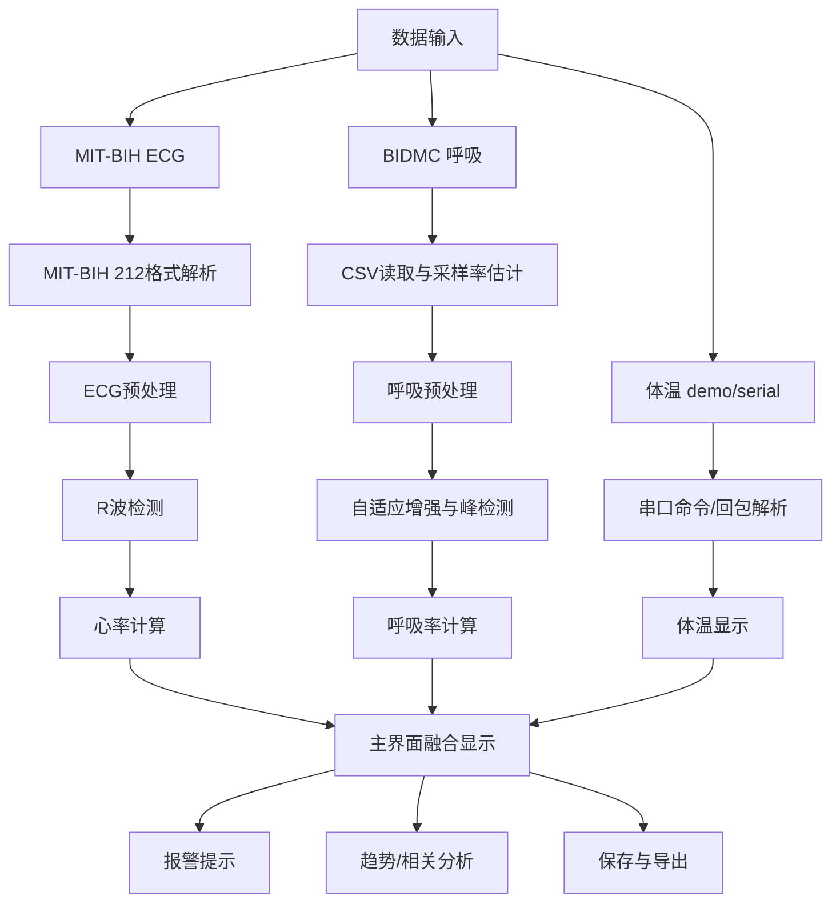

# 算法总体流程

## 1. 多生理参数处理链路

## 2. 数据准备算法

对应源码：

- `src/+bioio/getRandomDatasetPlan.m`
- `src/+bioio/ensurePublicDatasets.m`
- `src/+bioio/loadPreparedMonitoringData.m`

处理步骤：

1. 根据抽样模式选择 ECG 和呼吸记录池。
2. 优先使用本地已存在的数据文件。
3. 若数据缺失，从 PhysioNet 下载。
4. ECG 读取后调用 `bioalg.processEcg`。
5. 呼吸读取后调用 `bioalg.processRespiration`。
6. 处理结果保存到 `data/cache/`，后续运行直接加载缓存。

## 3. 抽样模式

| 模式 | ECG 记录池 | 呼吸记录池 | 用途 |
| --- | --- | --- | --- |
| `abnormal` | 优先心律异常记录 | 优先呼吸异常/波动记录 | 默认模式，便于演示报警和算法分析 |
| `mixed` | 正常/异常混合 | 正常/异常混合 | 用于随机性测试 |
| `normal` | 正常记录池 | 正常记录池 | 用于正常状态展示 |

## 4. 核心算法模块

| 模块 | 输入 | 输出 | 主要算法 |
| --- | --- | --- | --- |
| ECG 处理 | ECG 原始序列、采样率 | 滤波 ECG、R 波、心率、SNR | 基线校正、FFT 带通、差分包络、自适应阈值 |
| 呼吸处理 | 呼吸原始序列、采样率 | 增强呼吸、呼吸峰、呼吸率、SNR | 去基线、FFT 带通、ALE/LMS、自适应阈值 |
| 体温读取 | demo 或串口回包 | 体温值、状态、原始回包 | HEX 命令、ASCII 帧解析、`/10` 换算 |
| 融合分析 | HR、RR、Temp 和时间序列 | 报警、趋势、相关性 | 阈值判断、变异系数、相关系数、线性趋势 |

## 5. 实时性优化

主界面在 `BioMonitorApp.m` 中采用分频刷新：

| 变量 | 默认值 | 作用 |
| --- | --- | --- |
| `TimerObj.Period` | `0.25 s` | 主定时器周期 |
| `PlotRefreshPeriod` | `0.50 s` | 曲线刷新周期 |
| `MetricRefreshPeriod` | `1.00 s` | 参数刷新周期 |
| `AnalysisRefreshPeriod` | `2.00 s` | 分析文本刷新周期 |
| `TempReadPeriod` | `0.50 s` | 体温读取周期 |
| `MaxPlotPoints` | `1500` | 波形显示抽稀点数上限 |

这种设计可以减少 MATLAB UI 频繁重绘导致的卡顿，同时保持实时显示效果。
