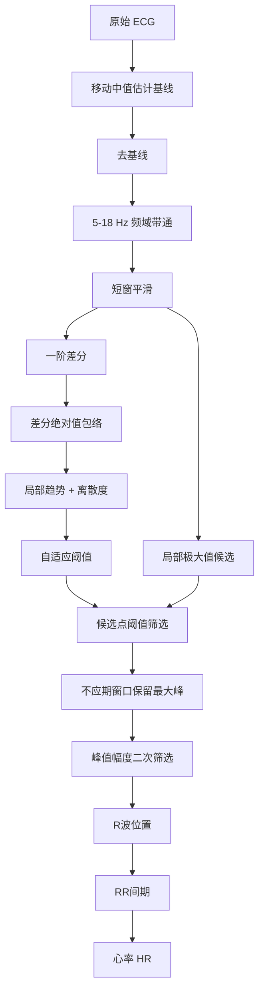

# ECG 心电算法

对应源码：`src/+bioalg/processEcg.m`

## 1. 算法目标

ECG 算法用于从 MIT-BIH 心电信号中检测 R 波，并基于 R-R 间期计算心率。算法需要在基线漂移、高频噪声和局部波形变化下保持较稳定的检测效果。

## 2. 输入输出

| 项目 | 内容 |
| --- | --- |
| 输入 | `signal`：单导联 ECG；`fs`：采样率 |
| 输出 | `filtered`：滤波后 ECG；`rLocs`：R 波采样点；`heartRate`：心率；`heartRateTimes`：心率时间轴；`snrDb`：信噪比估计 |

## 3. 处理流程



## 4. 关键步骤

### 4.1 基线校正

代码：

```matlab
baselineWindow = max(5, round(0.20 * fs));
baseline = movmedian(signal, baselineWindow, 'omitnan');
detrended = signal - baseline;
```

说明：

- 使用 0.20 秒窗口的移动中值估计基线；
- 原始信号减去基线，降低低频漂移影响；
- 移动中值比简单均值更不容易被尖峰影响。

### 4.2 带通滤波

代码：

```matlab
filtered = bioalg.bandpassSignal(detrended, fs, [5, 18]);
filtered = movmean(filtered, max(3, round(0.02 * fs)));
```

说明：

- 当前实现采用 `bandpassSignal.m` 中的 FFT 频域带通；
- 通带为 `5-18 Hz`，用于突出 QRS/R 波相关成分；
- 再用约 0.02 秒窗口做轻微平滑。

题目中提到 FIR 滤波，本项目采用频域带通作为当前可运行实现，达到带通去噪的目的。

### 4.3 差分包络

代码：

```matlab
diffSignal = [0; diff(filtered)];
diffEnvelope = movmean(abs(diffSignal), max(3, round(0.08 * fs)));
```

说明：

- R 波上升沿和下降沿斜率大；
- 一阶差分可以突出变化速度；
- 绝对值和移动均值形成平滑包络，减少单点毛刺。

### 4.4 自适应阈值

代码：

```matlab
trend = movmean(diffEnvelope, max(5, round(1.50 * fs)));
spread = movmean(abs(diffEnvelope - trend), max(5, round(1.50 * fs)));
threshold = trend + 1.40 .* spread;
```

说明：

- `trend` 表示差分包络的局部平均水平；
- `spread` 表示局部波动程度；
- 阈值等于局部趋势加 `1.40` 倍波动，自适应不同记录的幅度差异。

### 4.5 R 波候选点筛选

候选点需满足：

- 在滤波后 ECG 上是局部极大值；
- 该点差分包络大于自适应阈值。

候选不足时使用备用阈值：

```matlab
fallbackThreshold = mean(diffEnvelope, 'omitnan') + 0.60 * std(diffEnvelope, 'omitnan');
```

### 4.6 不应期峰值选择

对应源码：`src/+bioalg/selectPeaks.m`

```matlab
rLocs = bioalg.selectPeaks(candidateLocs, filtered, round(0.25 * fs));
```

说明：

- 0.25 秒内通常不应出现多个有效 R 波；
- 如果同一窗口内有多个候选点，保留幅度最大的点；
- 这个步骤可以减少重复检测。

### 4.7 心率计算

```matlab
rr = diff(rLocs) ./ fs;
heartRate = 60 ./ rr;
heartRateTimes = t(rLocs(2:end));
```

心率单位为 bpm。

## 5. 关键参数表

| 参数 | 当前值 | 作用 |
| --- | --- | --- |
| 基线窗口 | `0.20 s` | 估计并去除基线 |
| ECG 带通 | `5-18 Hz` | 突出 QRS/R 波 |
| 差分包络窗口 | `0.08 s` | 平滑差分绝对值 |
| 阈值趋势窗口 | `1.50 s` | 估计局部噪声/能量水平 |
| 阈值系数 | `1.40` | 控制候选点严格程度 |
| 备用阈值系数 | `0.60 * std` | 候选过少时使用 |
| R 波最小距离 | `0.25 s` | 防止重复检测 |

## 6. 可视化输出

导出文件：

- `ecg_before_after.png`
- `ecg_rwave_detection.png`
- `ecg_excerpt.csv`

图像含义：

| 图 | 说明 |
| --- | --- |
| 原始 ECG vs 滤波 ECG | 展示预处理前后的波形变化 |
| 差分包络 vs 自适应阈值 | 展示阈值检测依据 |
| R 波散点图 | 展示最终检测位置 |

## 7. 性能指标

当前项目使用：

- R 波数量；
- 平均心率、心率标准差、最小/最大心率；
- SNR 估计；
- RR 间期变异系数用于心律异常提示。

SNR 计算对应 `src/+bioalg/estimateSnr.m`：

```matlab
snrDb = 10 * log10((signalPower + eps) / (noisePower + eps));
```
