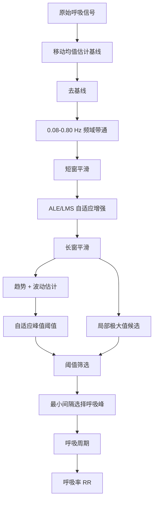

# 呼吸信号算法

对应源码：`src/+bioalg/processRespiration.m`

## 1. 算法目标

呼吸算法用于从 BIDMC 呼吸信号中提取呼吸峰位置，并根据相邻呼吸峰间隔计算呼吸率。题目要求采用自适应滤波抑制运动伪差，本项目使用 ALE 自适应线增强结构，并采用 LMS 形式更新权值。

## 2. 输入输出

| 项目 | 内容 |
| --- | --- |
| 输入 | `signal`：呼吸原始序列；`fs`：采样率 |
| 输出 | `bandpassed`：去基线带通后信号；`enhanced`：自适应增强后信号；`peakLocs`：呼吸峰位置；`respRate`：呼吸率；`snrDb`：信噪比估计 |

## 3. 处理流程



## 4. 关键步骤

### 4.1 基线去除

```matlab
baselineWindow = max(5, round(1.20 * fs));
baseline = movmean(signal, baselineWindow, 'omitnan');
detrended = signal - baseline;
```

说明：

- 呼吸信号周期慢，基线窗口设置为 1.20 秒；
- 使用移动均值估计慢变基线；
- 去基线后便于后续带通和峰值检测。

### 4.2 呼吸频段带通

```matlab
bandpassed = bioalg.bandpassSignal(detrended, fs, [0.08, 0.80]);
bandpassed = movmean(bandpassed, max(3, round(0.12 * fs)));
```

说明：

- 呼吸主要频段低于 ECG，当前通带为 `0.08-0.80 Hz`；
- 对应约 `4.8-48 bpm` 的呼吸频率范围；
- 平滑窗口约 0.12 秒。

### 4.3 ALE/LMS 自适应增强

代码：

```matlab
order = max(8, min(40, round(0.40 * fs)));
delay = max(order + 2, round(0.25 * fs));
stepSize = 0.015 / (order * max(var(bandpassed, 'omitnan'), eps));
[enhanced, errorSignal] = localRunAle(bandpassed, order, delay, stepSize);
```

ALE 是 Adaptive Line Enhancer，自适应线增强。其思想是：

- 呼吸信号具有周期性；
- 噪声和运动伪差相对更随机；
- 用延迟后的信号作为参考输入；
- 通过 LMS 更新权值，增强周期性成分。

LMS 权值更新在 `localRunAle` 中：

```matlab
enhanced(idx) = weights.' * reference;
errorSignal(idx) = signal(idx) - enhanced(idx);
weights = weights + 2 * stepSize * errorSignal(idx) * reference;
```

## 5. 自适应峰值检测

```matlab
trend = movmean(enhanced, max(5, round(4.00 * fs)));
spread = movmean(abs(enhanced - trend), max(5, round(4.00 * fs)));
threshold = trend + 0.20 .* spread;
```

说明：

- 使用 4 秒窗口估计呼吸信号的局部趋势；
- 阈值系数 `0.20` 较低，适应呼吸波峰幅值变化；
- 候选点必须是局部极大值并且高于阈值。

如果候选点过少，使用备用阈值：

```matlab
fallbackThreshold = mean(enhanced, 'omitnan') + 0.10 * std(enhanced, 'omitnan');
```

## 6. 呼吸峰选择与呼吸率计算

```matlab
peakLocs = bioalg.selectPeaks(candidateLocs, enhanced, round(1.40 * fs));
respIntervals = diff(peakLocs) ./ fs;
respRate = 60 ./ respIntervals;
```

说明：

- 呼吸峰最小间隔为 1.40 秒；
- 相邻呼吸峰间隔为呼吸周期；
- 呼吸率单位为 bpm。

## 7. 关键参数表

| 参数 | 当前值 | 作用 |
| --- | --- | --- |
| 基线窗口 | `1.20 s` | 去除慢变基线 |
| 呼吸带通 | `0.08-0.80 Hz` | 保留正常呼吸频段 |
| 平滑窗口 | `0.12 s` | 降低短时毛刺 |
| ALE 阶数 | `8-40`，约 `0.40*fs` | 自适应滤波长度 |
| ALE 延迟 | 至少 `order+2` 或 `0.25 s` | 构造延迟参考 |
| LMS 步长 | `0.015/(order*var)` | 根据能量归一化 |
| 增强后平滑 | `0.95 s` | 保留呼吸慢周期 |
| 阈值窗口 | `4.00 s` | 估计局部趋势 |
| 呼吸峰最小距离 | `1.40 s` | 避免重复检测 |

## 8. 可视化输出

导出文件：

- `resp_before_after.png`
- `resp_peak_detection.png`
- `respiration_excerpt.csv`

图像含义：

| 图 | 说明 |
| --- | --- |
| 原始呼吸 vs 增强呼吸 | 展示 ALE/LMS 增强效果 |
| 带通信号 vs 阈值 | 展示峰值检测依据 |
| 呼吸峰散点图 | 展示最终呼吸峰位置 |

## 9. 性能指标

当前项目使用：

- 呼吸峰数量；
- 平均呼吸率、呼吸率标准差、最小/最大呼吸率；
- SNR 估计；
- 呼吸周期变异系数；
- 呼吸率越界判断。
