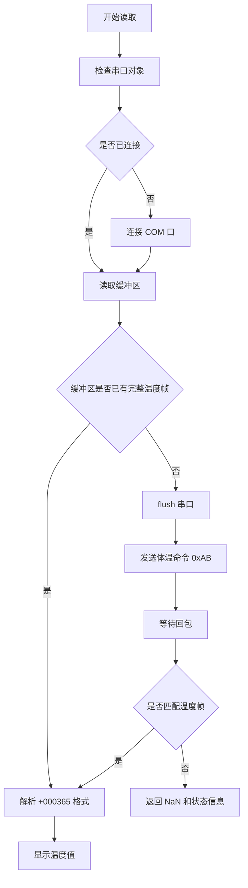

# 体温读取算法

对应源码：

- `src/+tempsrc/TemperatureStream.m`
- `temperature_sensor_ui.m`
- `src/TemperatureSensorReaderApp.m`

## 1. 算法目标

体温模块用于从 Type-C 红外体温传感器读取体温值，并在综合主界面或独立体温 UI 中显示。当前实现强调“正常读取和显示”，不对体温值做额外补偿、偏移或校准。

## 2. 运行模式

| 模式 | 说明 |
| --- | --- |
| `demo` | 软件生成的占位体温序列，用于没有硬件时联调 |
| `serial` | 通过真实串口读取 Type-C 体温模块 |

综合主界面和独立体温 UI 默认使用体温模式 `body`。

## 3. 串口协议

| 项目 | 当前设置 |
| --- | --- |
| 默认端口 | `COM7` |
| 默认波特率 | `9600` |
| 数据位 | `8` |
| 校验 | `N / none` |
| 停止位 | `1` |
| 发送格式 | HEX 单字节 |
| 接收格式 | ASCII |
| 体温命令 | `0xAB` |
| 物温命令 | `0xAA` |
| 返回示例 | `+000365` |
| 显示换算 | `str2double('+000365') / 10 = 36.5 °C` |

## 4. 串口读取流程



## 5. 温度帧解析

代码逻辑：

```matlab
token = regexp(char(rawText), '[+-]\d{6}', 'match', 'once');
value = str2double(token) ./ 10.0;
```

说明：

- 使用正则表达式匹配一段 7 字符温度帧；
- 第一位为 `+` 或 `-`；
- 后 6 位为数字；
- 除以 10 得到摄氏温度。

示例：

| 原始回包 | 解析数值 | 显示 |
| --- | --- | --- |
| `+000365` | `36.5` | `36.5 °C` |
| `+000372` | `37.2` | `37.2 °C` |
| `+000358` | `35.8` | `35.8 °C` |

## 6. demo 体温序列

当没有真实硬件时，`TemperatureStream` 可使用 demo 模式：

```matlab
value = baseValue + ...
    0.08 * sin(2 * pi * obj.demoCounter / 90) + ...
    0.04 * cos(2 * pi * obj.demoCounter / 37) + ...
    0.02 * randn();
```

默认体温基准：

| 模式 | 基准值 |
| --- | --- |
| `body` | `36.6 °C` |
| `object` | `25.0 °C` |

主程序当前默认按体温 `body` 读取和显示。

## 7. 异常帧处理

| 情况 | 处理方式 |
| --- | --- |
| 串口不可用 | 状态显示串口错误，体温为 `NaN` |
| 未收到回包 | 状态提示无有效数据，体温为 `NaN` |
| 收到非温度格式回包 | 状态提示未匹配 `+000365` 格式 |
| 正常收到回包 | 显示解析温度并更新曲线 |

## 8. 与报警和 UI 卡顿的关系

报警只显示在界面中，不调用 `beep`、`sound` 或其他音频动作，避免体温异常时 UI 因蜂鸣或音频阻塞而卡顿。

## 9. 使用建议

- 确认设备管理器中端口为 `COM7`。
- 确认体温模式为 `body`。
- 保持传感器说明书要求的测量距离和角度。
- 观察独立 UI 中的“原始回包”，优先判断传感器返回是否稳定。
- 若连续无回包，检查 CH340 驱动、端口占用和波特率。
