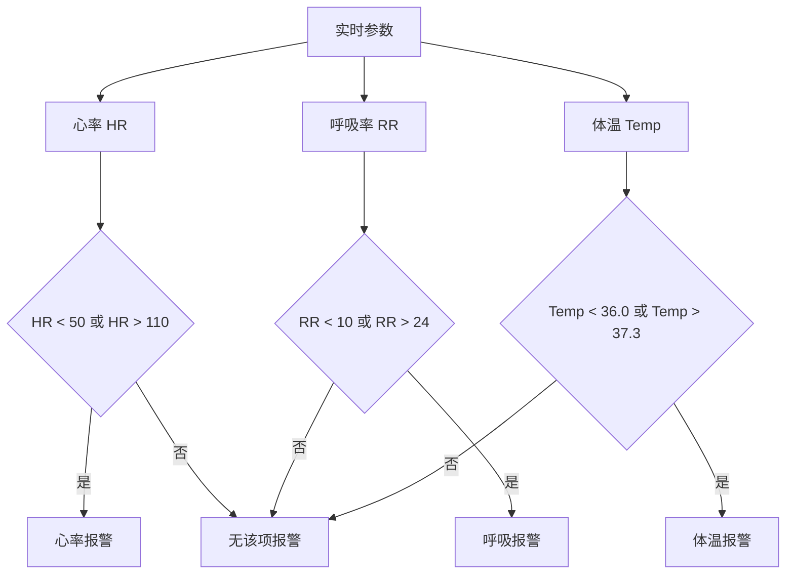
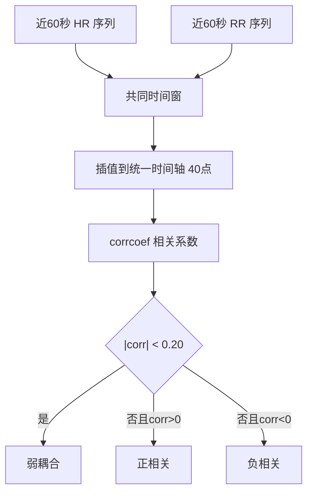

# 融合分析与报警算法

对应源码：`src/BioMonitorApp.m`

## 1. 算法目标

综合监护界面不仅显示三路信号，还对心率、呼吸率、体温进行简单融合分析，形成报警提示、节律状态、心呼相关和体温趋势。

## 2. 实时参数刷新

主界面不是每个定时器周期都全量重绘，而是分层刷新：

| 项目 | 周期 | 说明 |
| --- | --- | --- |
| 主定时器 | `0.25 s` | 推进 ECG/呼吸游标 |
| 曲线刷新 | `0.50 s` | 刷新三路曲线 |
| 参数刷新 | `1.00 s` | 刷新 HR、RR、Temp 和报警 |
| 分析刷新 | `2.00 s` | 刷新分析文本 |
| 体温读取 | `0.50 s` | 周期性读取体温 |

## 3. 阈值报警



| 参数 | 正常范围 | 报警文字 |
| --- | --- | --- |
| 心率 | `50-110 bpm` | `心率报警: x bpm` |
| 呼吸率 | `10-24 bpm` | `呼吸报警: x bpm` |
| 体温 | `36.0-37.3 °C` | `体温报警: x °C` |

当前报警只显示文字，不发声。

## 4. 心律异常提示

对应函数：`detectEcgIrregularity`

处理逻辑：

1. 取当前时间前 25 秒内的心率序列。
2. 将心率转换为 RR 间期：`RR interval = 60 / HR`。
3. 计算 RR 间期变异系数：

```matlab
cv = std(rrIntervals, 'omitnan') / max(mean(rrIntervals, 'omitnan'), eps);
```

4. 计算 RR 间期相对中位数的最大偏差。
5. 若 `cv > 0.12` 或最大偏差大于 `0.18 s`，提示 RR 变异偏大。

## 5. 呼吸节律异常提示

对应函数：`detectRespIrregularity`

处理逻辑：

1. 取当前时间前 35 秒内的呼吸率序列。
2. 将呼吸率转换为呼吸周期：`resp interval = 60 / RR`。
3. 计算呼吸周期变异系数。
4. 若 `cv > 0.18`，或呼吸率出现大于 24 bpm、小于 10 bpm 的情况，提示呼吸节律波动较大。

## 6. 心呼相关分析

对应函数：`estimateFusionCorrelation`



说明：

- 心率和呼吸率采样时刻不同；
- 先取共同时间窗；
- 使用 `interp1` 插值到统一时间轴；
- 使用 `corrcoef` 计算相关系数；
- 用阈值 `0.20` 区分弱耦合和明显相关。

## 7. 体温趋势

对应函数：`estimateTemperatureTrend`

处理逻辑：

1. 至少需要 6 个体温样本。
2. 取最近 30 秒有效体温值。
3. 对 `Temp-Time` 做一次线性拟合：

```matlab
coeffs = polyfit(app.TempTimes(recentMask), app.TempValues(recentMask), 1);
slopePerMinute = coeffs(1) * 60;
```

4. 若斜率大于 `0.08 °C/min`，显示升温；
5. 若斜率小于 `-0.08 °C/min`，显示降温；
6. 否则显示基本稳定。

## 8. 分析区输出内容

`buildAnalysisLines` 生成的分析文本包括：

- 随机模式；
- 当前 ECG 记录；
- 当前 Resp 记录；
- ECG SNR；
- Resp SNR；
- 累计 R 波；
- 累计呼吸峰；
- 心律状态；
- 呼吸节律状态；
- 心呼相关；
- 体温趋势；
- HR/RR 比值；
- 会话时长。

## 9. 设计特点

- 使用简单、可解释的阈值和统计指标，便于答辩说明；
- 报警逻辑与音频动作解耦，只显示不蜂鸣；
- 刷新频率分层，降低 UI 卡顿；
- 心呼相关和体温趋势属于初步融合分析，可作为后续扩展基础。
