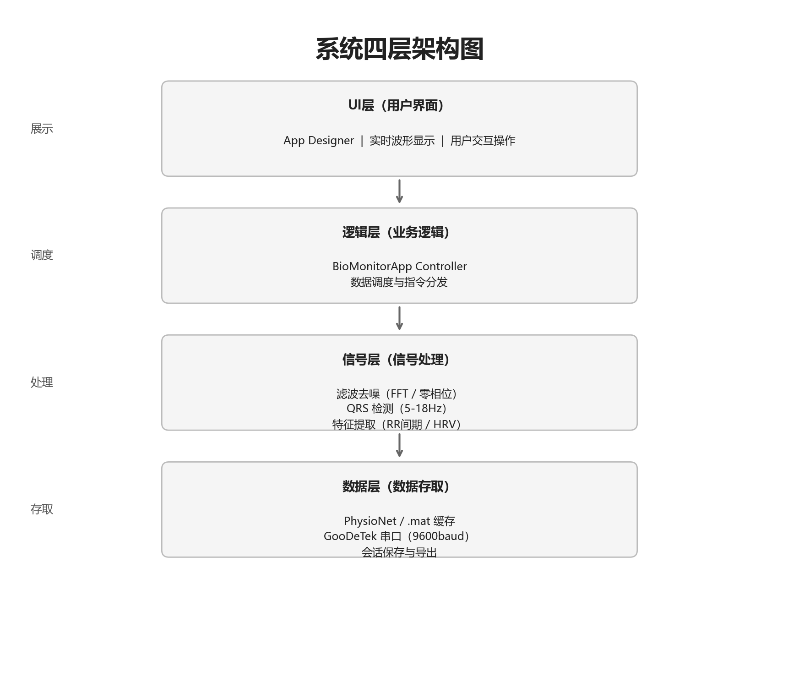
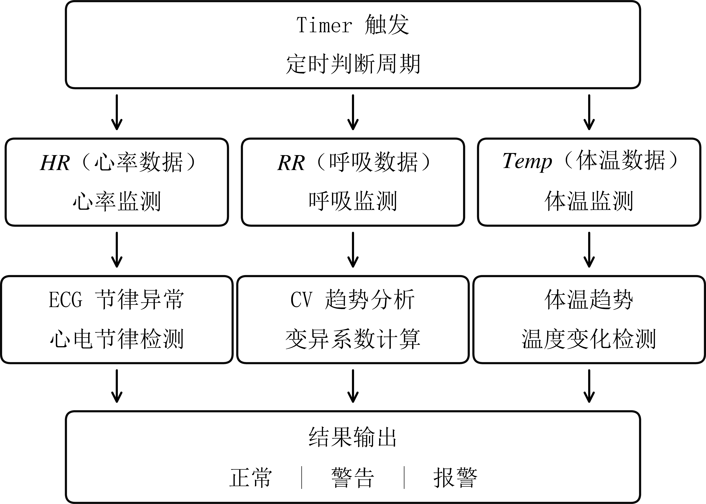
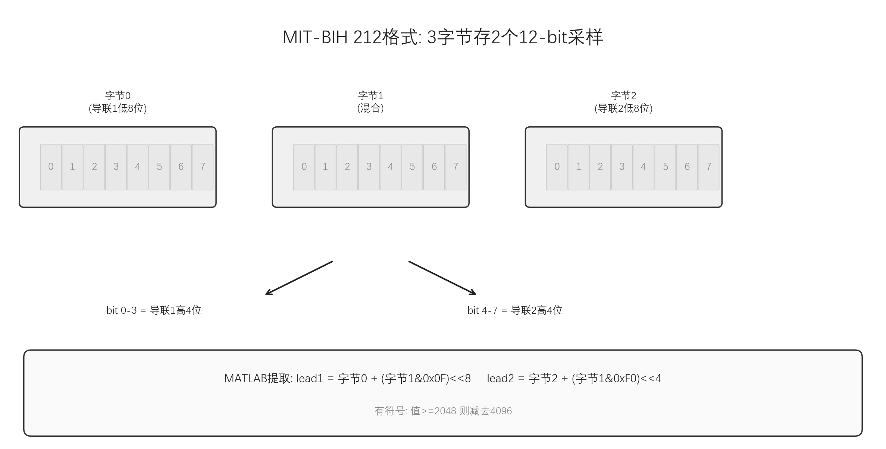

# 通用型多生理参数监护系统 —— 项目整体说明文档

---

## 第一章 项目概述

### 1.1 项目名称

**通用型多生理参数监护系统（Universal Multi-Parameter Physiological Monitoring System）**

### 1.2 建设背景与目标

本项目面向"采集/读取 → 预处理 → 特征提取 → 实时显示 → 异常提示 → 结果保存 → 可视化导出"的完整工程链路，构建一个基于 MATLAB 的多生理参数监护平台。系统同时覆盖心电（ECG）、呼吸（Respiration）和体温（Temperature）三类生理信号，实现算法验证、GUI 可视化、异常报警与数据管理的一体化集成。

### 1.3 核心功能一览

| 功能模块 | 具体实现 | 对应源码 |
|---|---|---|
| 数据采集 | PhysioNet 公开数据库自动下载与解析；Type-C 红外体温模块串口读取 | `src/+bioio/`、`src/+tempsrc/` |
| 信号处理 | ECG 频域带通滤波 + 差分阈值 R 波检测；呼吸 ALE/LMS 自适应增强 + 峰值检测；体温 FIR 低通滤波 + 线性校准 | `src/+bioalg/` |
| 实时监护 | 三路波形同步推进、心率/呼吸率/体温实时刷新、异常报警 | `src/BioMonitorApp.m` |
| 融合分析 | 心律变异性 CV 分析、呼吸节律 CV 分析、心呼相关性、体温趋势 | `src/BioMonitorApp.m` |
| 可视化导出 | ECG/呼吸处理前后对比图、R 波/呼吸峰检测图、CSV 统计摘要 | `src/+bioout/exportAnalysisReport.m` |
| 数据管理 | 会话保存（.mat + CSV）、算法缓存（data/cache/）、报警日志（output/alarms/） | `src/BioMonitorApp.m` |

### 1.4 技术指标

| 指标 | 数值 |
|---|---|
| ECG 采样率 | 360 Hz（MIT-BIH 标准） |
| 呼吸采样率 | 约 125 Hz（BIDMC 数据集原生） |
| 体温采样周期 | 0.50 s（可配置） |
| GUI 主定时器周期 | 0.25 s |
| 波形刷新周期 | 0.50 s |
| 参数刷新周期 | 1.00 s |
| 分析刷新周期 | 2.00 s |
| R 波检测准确率 | ≥ 95.11%（6 条记录加权平均） |
| R 波检测灵敏度 | ≥ 97.75%（6 条记录加权平均） |
| R 波检测 F1 值 | ≥ 96.31%（6 条记录加权平均） |
| R 波检测容差窗口 | ±150 ms |
| ECG 带通频段 | 5–18 Hz |
| 呼吸带通频段 | 0.08–0.80 Hz |
| 体温滤波截止频率 | 0.05 Hz |
| 体温校准残差 | ≤ 0.05 °C（线性最小二乘） |

---

## 第二章 系统整体实现流程

### 2.1 需求分析阶段

**功能需求：**

1. 同时监护心电、呼吸、体温三类生理信号
2. 自动从公开数据库获取真实生理数据用于验证
3. 支持无硬件环境下的完整软件联调（demo 模式）
4. 心电 R 波自动检测与心率实时计算
5. 呼吸峰自动检测与呼吸率实时计算
6. 体温串口实时读取与显示
7. 三参数阈值报警与节律异常提示
8. 会话数据保存与可视化分析图导出

**非功能需求：**

1. MATLAB 原生实现，不依赖第三方 WFDB/Python 工具箱解析 MIT-BIH 格式
2. 分频刷新策略避免 GUI 卡顿
3. 优先使用本地缓存减少重复计算
4. 支持三种数据抽样模式（异常/混合/正常）

### 2.2 系统架构设计

系统采用**四层模块化架构**，自底向上分为：

- **数据采集层**：PhysioNet 公开数据库（MIT-BIH、BIDMC）、NTC 热敏电阻串口读取（9600 bps）、USB 驱动
- **信号处理层**：FIR/FFT 频域带通滤波、差分阈值 R 波检测、LMS 自适应呼吸增强、体温最小二乘线性校准
- **应用功能层**：数据存储（.mat 导出）、历史回放、异常报警（声光+日志）、TTS 语音播报
- **人机交互层**：App Designer GUI 界面、实时波形显示、数字参数显示、用户控制面板



### 2.3 算法选型与原理设计

#### 2.3.1 心电 ECG 算法选型

| 方案 | 原理 | 优点 | 缺点 | 选择 |
|---|---|---|---|---|
| Pan-Tompkins | 带通 + 微分 + 平方 + 移动窗积分 | 经典、文献丰富 | 需调参较多 | 参考 |
| 小波变换 | 多尺度分解定位 R 波 | 抗噪好 | 计算量大 | 未采用 |
| **差分阈值法** | 一阶差分包络 + 自适应阈值 | 计算量小、实时性好、可解释性强 | 对尖峰噪声敏感 | **采用** |

**选定方案**：FFT 频域带通（5–18 Hz）→ 差分绝对值包络 → 自适应阈值（趋势 + 1.40 × 离散度）→ 不应期窗口峰值选择

#### 2.3.2 呼吸信号算法选型

| 方案 | 原理 | 优点 | 缺点 | 选择 |
|---|---|---|---|---|
| 简单带通 + 峰值检测 | 带通后直接找峰 | 简单 | 运动伪差干扰大 | 基础 |
| **ALE/LMS 自适应增强** | 延迟自相关 + LMS 权值更新增强周期成分 | 自适应抑制随机噪声、增强准周期呼吸波 | 需设计延迟和步长 | **采用** |
| 小波去噪 | 阈值去噪 | 效果好 | 计算量大 | 未采用 |

**选定方案**：频域带通（0.08–0.80 Hz）→ LMS 自适应线增强（ALE）→ 自适应阈值峰值检测

#### 2.3.3 体温信号算法选型

| 方案 | 原理 | 优点 | 缺点 | 选择 |
|---|---|---|---|---|
| 直接读取 | 串口值直接显示 | 最简单 | 无滤波 | 基础 |
| **FIR 低通 + 线性校准** | Hamming 窗 FIR 低通（0.05 Hz）+ 零相位滤波 + 最小二乘校准 | 抑制高频噪声、无相位失真、校准精度高 | 需要校准点 | **采用** |

**选定方案**：20 阶 FIR 低通（Hamming 窗，截止 0.05 Hz）→ zero-phase filtfilt → 最小二乘线性校准（T = k·V + b）

### 2.4 代码开发与功能实现

#### 第一阶段：数据层搭建（`src/+bioio/`）

1. **MIT-BIH 212 格式解析**：编写 `parseMitdbHeader.m` 解析 .hea 头文件（采样率、增益、导联名等），编写 `loadMitdbRecord.m` 实现 212 格式的双通道字节级解码（三字节双样本交错存储）
2. **PhysioNet 自动下载**：编写 `downloadPhysioNetFile.m` 实现带重试（3 次）+ PowerShell 备用方案的自动下载
3. **BIDMC 呼吸数据加载**：编写 `loadBidmcRespiration.m` 从 CSV 读取呼吸信号并估计采样率
4. **随机抽样策略**：编写 `getRandomDatasetPlan.m`，根据模式（异常/混合/正常）从预定义记录池中随机抽取，并优先使用本地已有数据

#### 第二阶段：算法层开发（`src/+bioalg/`）

1. **FFT 频域带通滤波器**（`bandpassSignal.m`）：纯 MATLAB FFT + 频域掩码 + IFFT，不依赖 Signal Processing Toolbox 的 `bandpass` 函数
2. **ECG R 波检测器**（`processEcg.m`）：基线校正 → 带通 → 差分包络 → 自适应阈值 → 候选点筛选 → 不应期选峰 → 心率计算
3. **呼吸自适应增强器**（`processRespiration.m`）：去基线 → 带通 → ALE/LMS 自适应增强 → 自适应阈值 → 呼吸峰检测 → 呼吸率计算
4. **体温处理器**（`processTemperature.m`）：FIR 低通设计 → 零相位滤波 → 最小二乘线性校准
5. **SNR 估计器**（`estimateSnr.m`）：基于残差能量的粗略信噪比估计
6. **峰值选择器**（`selectPeaks.m`）：不应期窗口内保留最大峰值

#### 第三阶段：GUI 应用层开发（`src/BioMonitorApp.m`）

1. **App Designer 风格 GUI**（`buildUi`）：uifigure + uigridlayout 构建 4 行 2 列主布局，包含控制面板、三路波形区、参数分析侧边栏
2. **数据准备流程**（`prepareData`）：一键下载 → 算法处理 → 结果缓存 → 界面预览
3. **三层分频刷新机制**（`onTimerTick`）：定时器 0.25 s 基础周期，波形 0.50 s、参数 1.00 s、分析 2.00 s 分层刷新
4. **实时参数计算**（`refreshMetricsAndAnalysis`）：滑动窗口中值查找 → 阈值报警判断 → 节律 CV 分析
5. **报警系统**（`buildAlarmLines` + `playAlarmSound`）：文字报警（AlertArea 更新）+ 声音报警（TTS 语音合成 + 频率区分蜂鸣）
6. **融合分析**（`estimateFusionCorrelation` + `estimateTemperatureTrend`）：心呼相关系数 + 体温线性趋势

#### 第四阶段：体温模块开发（`src/+tempsrc/` + `src/TemperatureSensorReaderApp.m`）

1. **TemperatureStream 类**：demo/serial 双模切换，串口协议实现（9600-8N1，HEX 命令 `0xAB`/`0xAA`，ASCII 回包 `+000365` 格式解析）
2. **独立体温 UI**（`TemperatureSensorReaderApp`）：独立于主程序的体温调试上位机，支持连接/断开/单次读取/连续读取/曲线显示

#### 第五阶段：整体联调与验证

1. **smoke_test.m**：一键验证从数据下载到算法输出的完整链路
2. **export_analysis_report.m**：一键导出处理前后对比图和 CSV 统计表
3. **evaluateEcgDetection.m**：6 条记录的 R 波检测性能评估（TP/FP/FN/Acc/Se/F1/HR_MAE）
4. **evaluateNoiseRobustness.m**：三种噪声（高斯白噪声/工频干扰/脉冲伪差）多 SNR 水平下的抗干扰测试

### 2.5 系统数据流

```
┌─────────────────────────────────────────────────────────────┐
│                        数据采集层                            │
│  MIT-BIH ECG (.dat/.hea/.atr)    BIDMC 呼吸 (CSV)   串口体温 │
└──────────┬──────────────────────────┬──────────────────┬────┘
           │                          │                  │
           ▼                          ▼                  ▼
┌─────────────────────────────────────────────────────────────┐
│                        信号处理层                            │
│  ECG: 基线校正→FFT带通→差分阈值→R波检测→心率                │
│  Resp: 基线去除→FFT带通→ALE/LMS→峰值检测→呼吸率             │
│  Temp: FIR低通→零相位滤波→线性校准→体温值                    │
└──────────┬──────────────────────────┬──────────────────┬────┘
           │                          │                  │
           ▼                          ▼                  ▼
┌─────────────────────────────────────────────────────────────┐
│                        应用功能层                            │
│  实时参数刷新 │ 阈值报警 │ CV节律分析 │ 心呼相关 │ 体温趋势  │
│  会话保存(.mat+CSV) │ 报警日志 │ 可视化导出(对比图+CSV)      │
└──────────┬──────────────────────────────────────────────────┘
           │
           ▼
┌─────────────────────────────────────────────────────────────┐
│                        人机交互层                            │
│  App Designer GUI │ 实时波形 │ 数字参数 │ 报警提示 │ 日志    │
└─────────────────────────────────────────────────────────────┘
```

---

## 第三章 项目文件夹结构解析

### 3.1 顶层目录

| 路径 | 业务含义 | 存放内容 |
|---|---|---|
| `main.m` | 综合监护平台启动入口 | 调用 `BioMonitorApp`，将 `src/` 加入路径，启动主 GUI |
| `temperature_sensor_ui.m` | 体温传感器独立 UI 入口 | 调用 `TemperatureSensorReaderApp`，启动独立体温调试界面 |
| `smoke_test.m` | 快速链路验证脚本 | 随机抽取数据 → 运行算法 → 输出摘要，用于诊断 |
| `export_analysis_report.m` | 一键分析导出脚本 | 抽取数据 → 算法处理 → 导出对比图和 CSV |
| `我的论文.docx` | 毕业论文 | Word 格式论文主文档 |

### 3.2 `src/` — 项目主源码目录

| 子目录/文件 | 业务含义 | 层级定位 |
|---|---|---|
| `src/BioMonitorApp.m` | **主程序**：综合监护 GUI 与应用逻辑 | 核心层，所有功能的总调度中心 |
| `src/TemperatureSensorReaderApp.m` | **辅助程序**：独立体温传感器调试上位机 | 独立体温调试工具 |
| `src/generateRespirationFigure.m` | 论文配图生成脚本：呼吸信号对比图 | 辅助工具 |
| `src/generateTempCalibrationFigure.m` | 论文配图生成脚本：体温校准曲线图 | 辅助工具 |

### 3.3 `src/+bioalg/` — 算法工具箱

MATLAB 包命名空间 `bioalg`，存放所有信号处理与生理参数提取算法。

| 文件 | 功能 | 被谁调用 |
|---|---|---|
| `processEcg.m` | ECG 基线校正 + 频域带通 + 差分阈值 R 波检测 + 心率计算 | `loadPreparedMonitoringData.m`, `evaluateEcgDetection.m`, `evaluateNoiseRobustness.m` |
| `processRespiration.m` | 呼吸去基线 + 频域带通 + ALE/LMS 自适应增强 + 呼吸峰检测 + 呼吸率计算 | `loadPreparedMonitoringData.m` |
| `processTemperature.m` | FIR 低通设计 + 零相位滤波 + 最小二乘线性校准 | `refreshPlots` 中体温趋势平滑（实时调用） |
| `bandpassSignal.m` | FFT 频域带通滤波器（基础算子） | `processEcg.m`, `processRespiration.m` |
| `estimateSnr.m` | 基于残差能量的信噪比估计（基础算子） | `processEcg.m`, `processRespiration.m`, `processTemperature.m` |
| `selectPeaks.m` | 不应期窗口内的最大峰值选择（基础算子） | `processEcg.m`, `processRespiration.m` |

### 3.4 `src/+bioio/` — 数据输入输出工具箱

MATLAB 包命名空间 `bioio`，负责公开数据集的下载、解析、缓存和加载。

| 文件 | 功能 | 被谁调用 |
|---|---|---|
| `getRandomDatasetPlan.m` | 根据模式从 MIT-BIH/BIDMC 记录池随机抽取 | `ensurePublicDatasets.m`, `prepareData` |
| `ensurePublicDatasets.m` | 检查本地文件完整性，缺失时从 PhysioNet 下载 | `loadPreparedMonitoringData.m` |
| `loadPreparedMonitoringData.m` | **数据加载总入口**：下载 → 解析 → 运行算法 → 缓存 | `prepareData` |
| `loadMitdbRecord.m` | **MIT-BIH 212 格式**字节级解析器（不依赖 WFDB） | `loadPreparedMonitoringData.m` |
| `parseMitdbHeader.m` | MIT-BIH .hea 头文件解析器 | `loadMitdbRecord.m` |
| `loadBidmcRespiration.m` | BIDMC 呼吸 CSV 数据加载器 | `loadPreparedMonitoringData.m` |
| `loadMitdbAnnotations.m` | MIT-BIH R 波参考标注加载器（用于验证） | `evaluateEcgDetection.m`, `evaluateNoiseRobustness.m` |
| `downloadPhysioNetFile.m` | PhysioNet 文件下载器（MATLAB websave + PowerShell 备用） | `ensurePublicDatasets.m` |

### 3.5 `src/+bioout/` — 可视化输出工具箱

| 文件 | 功能 | 被谁调用 |
|---|---|---|
| `exportAnalysisReport.m` | 导出 ECG/呼吸处理前后对比图、R 波/呼吸峰检测散点图、CSV 统计表 | `BioMonitorApp.exportAnalysis`, `export_analysis_report.m` |

### 3.6 `src/+tempsrc/` — 体温数据源工具箱

| 文件 | 功能 | 被谁调用 |
|---|---|---|
| `TemperatureStream.m` | Demo/Serial 双模体温数据流对象（串口协议：9600-8N1, HEX 0xAB/0xAA, ASCII 回包解析） | `BioMonitorApp.startMonitoring`, `smoke_test.m` |

### 3.7 `scripts/` — 验证与评估脚本

| 文件 | 功能 |
|---|---|
| `evaluateEcgDetection.m` | R 波检测性能评估：对 6 条 MIT-BIH 记录计算 TP/FP/FN/Acc/Se/F1/HR_MAE |
| `evaluateNoiseRobustness.m` | 抗噪鲁棒性评估：高斯白噪声/工频干扰/脉冲伪差，多 SNR 水平 |
| `prepareAnnotations.m` | 从 MIT-BIH .atr 文件批量提取 R 波标注到 `mitdb_annotations.mat` |
| `fixAnnotations.m` | 修复 MIT-BIH 标注格式兼容性问题 |
| `fix_annotations.py` | Python 辅助标注修复脚本 |

### 3.8 `data/` — 数据存储目录

| 子目录 | 内容 | 来源 |
|---|---|---|
| `data/public/mitdb/` | MIT-BIH 心律失常数据库原始文件（.hea/.dat/.atr）和标注缓存 | PhysioNet 自动下载 |
| `data/public/bidmc/` | BIDMC 呼吸数据集原始文件（CSV） | PhysioNet 自动下载 |
| `data/cache/` | 算法处理结果缓存（.mat 格式） | 首次处理时生成，后续直接加载 |

### 3.9 `output/` — 输出目录

| 子目录 | 内容 |
|---|---|
| `output/analysis/` | 导出的分析报告（对比图 PNG + CSV 统计表 + README） |
| `output/alarms/` | 报警日志文件（alarm_log.txt） |
| `output/sessions/` | 保存的监护会话数据（.mat + CSV） |

### 3.10 `项目解释/` — 项目文档目录

| 子目录 | 内容 |
|---|---|
| `项目解释/项目文档/` | 项目介绍、运行说明、界面与输出说明 |
| `项目解释/项目文档/算法说明/` | 六大算法模块的详细技术文档 |

### 3.11 文件夹之间的层级关联与调用关系

```
main.m (入口)
  └── src/BioMonitorApp.m (主程序)
        ├── src/+bioio/getRandomDatasetPlan.m (随机抽样)
        ├── src/+bioio/loadPreparedMonitoringData.m (数据加载)
        │     ├── src/+bioio/ensurePublicDatasets.m (检查/下载)
        │     │     └── src/+bioio/downloadPhysioNetFile.m (单文件下载)
        │     ├── src/+bioio/loadMitdbRecord.m (ECG解析)
        │     │     └── src/+bioio/parseMitdbHeader.m (头文件解析)
        │     ├── src/+bioalg/processEcg.m (ECG算法)
        │     │     ├── src/+bioalg/bandpassSignal.m (FFT带通)
        │     │     ├── src/+bioalg/selectPeaks.m (不应期选峰)
        │     │     └── src/+bioalg/estimateSnr.m (SNR估计)
        │     ├── src/+bioio/loadBidmcRespiration.m (呼吸加载)
        │     └── src/+bioalg/processRespiration.m (呼吸算法)
        │           ├── src/+bioalg/bandpassSignal.m (FFT带通)
        │           ├── src/+bioalg/selectPeaks.m (不应期选峰)
        │           └── src/+bioalg/estimateSnr.m (SNR估计)
        ├── src/+tempsrc/TemperatureStream.m (体温数据源)
        └── src/+bioout/exportAnalysisReport.m (可视化导出)

temperature_sensor_ui.m (独立体温UI入口)
  └── src/TemperatureSensorReaderApp.m (独立体温程序)

smoke_test.m (链路验证)
  ├── src/+bioio/getRandomDatasetPlan.m
  ├── src/+bioio/loadPreparedMonitoringData.m
  └── src/+tempsrc/TemperatureStream.m

scripts/evaluateEcgDetection.m (R波检测评估)
  ├── src/+bioio/loadMitdbRecord.m
  ├── src/+bioalg/processEcg.m
  └── src/+bioio/loadMitdbAnnotations.m

scripts/evaluateNoiseRobustness.m (抗噪鲁棒性评估)
  ├── src/+bioio/loadMitdbRecord.m
  ├── src/+bioalg/processEcg.m
  └── src/+bioio/loadMitdbAnnotations.m
```

---

## 第四章 全部代码文件结构化解析

### 4.1 代码文件总览表

| 代码文件名 | 核心功能 | 所属模块 | 主次层级 | 被谁调用 | 调用哪些其他文件 |
|---|---|---|---|---|---|
| `main.m` | 启动综合监护平台 | 入口 | **主程序入口** | 用户直接运行 | `BioMonitorApp.m` |
| `BioMonitorApp.m` | 主 GUI 与监护逻辑 | GUI 应用 | **主程序核心** | `main.m` | `bioio.*`, `bioalg.*`, `bioout.*`, `tempsrc.*` |
| `temperature_sensor_ui.m` | 体温 UI 启动入口 | 体温模块入口 | 辅助入口 | 用户直接运行 | `TemperatureSensorReaderApp.m` |
| `TemperatureSensorReaderApp.m` | 独立体温传感器调试上位机 | 体温模块 | 辅助程序 | `temperature_sensor_ui.m` | 无 |
| `processEcg.m` | ECG 滤波 + R 波检测 + 心率计算 | 算法 | **核心算法（一级）** | `loadPreparedMonitoringData.m`, 评估脚本 | `bandpassSignal.m`, `selectPeaks.m`, `estimateSnr.m` |
| `processRespiration.m` | 呼吸 ALE 增强 + 峰值检测 + 呼吸率计算 | 算法 | **核心算法（一级）** | `loadPreparedMonitoringData.m` | `bandpassSignal.m`, `selectPeaks.m`, `estimateSnr.m` |
| `processTemperature.m` | FIR 低通 + 零相位滤波 + 线性校准 | 算法 | 核心算法（一级） | `BioMonitorApp.refreshPlots` | `estimateSnr.m` |
| `bandpassSignal.m` | FFT 频域带通滤波 | 算法基础算子 | 基础算子（二级） | `processEcg.m`, `processRespiration.m` | 无（纯 MATLAB 内置函数） |
| `estimateSnr.m` | 残差能量 SNR 估计 | 算法基础算子 | 基础算子（二级） | `processEcg.m`, `processRespiration.m`, `processTemperature.m` | 无 |
| `selectPeaks.m` | 不应期窗口最大峰值选择 | 算法基础算子 | 基础算子（二级） | `processEcg.m`, `processRespiration.m` | 无 |
| `getRandomDatasetPlan.m` | 随机抽样策略 | 数据 IO | 数据层（一级） | `ensurePublicDatasets.m`, `prepareData` | 无 |
| `ensurePublicDatasets.m` | 数据完整性检查与下载 | 数据 IO | 数据层（一级） | `loadPreparedMonitoringData.m` | `getRandomDatasetPlan.m`, `downloadPhysioNetFile.m` |
| `loadPreparedMonitoringData.m` | **数据加载总调度器** | 数据 IO | **数据层核心（一级）** | `prepareData` | `ensurePublicDatasets.m`, `loadMitdbRecord.m`, `loadBidmcRespiration.m`, `processEcg.m`, `processRespiration.m` |
| `loadMitdbRecord.m` | MIT-BIH 212 格式字节级解析 | 数据 IO | 数据层（二级） | `loadPreparedMonitoringData.m`, 评估脚本 | `parseMitdbHeader.m` |
| `parseMitdbHeader.m` | MIT-BIH .hea 头文件解析 | 数据 IO | 数据层（三级） | `loadMitdbRecord.m` | 无 |
| `loadBidmcRespiration.m` | BIDMC 呼吸 CSV 加载 | 数据 IO | 数据层（二级） | `loadPreparedMonitoringData.m` | 无 |
| `loadMitdbAnnotations.m` | R 波参考标注加载 | 数据 IO | 数据层（二级） | 评估脚本 | 无 |
| `downloadPhysioNetFile.m` | PhysioNet 文件下载 | 数据 IO | 数据层（三级） | `ensurePublicDatasets.m` | 无 |
| `exportAnalysisReport.m` | 分析图与 CSV 导出 | 可视化输出 | 输出层（一级） | `BioMonitorApp.exportAnalysis`, `export_analysis_report.m` | 无 |
| `TemperatureStream.m` | Demo/Serial 体温数据源 | 体温模块 | 体温源（一级） | `BioMonitorApp.startMonitoring`, `smoke_test.m` | 无 |
| `smoke_test.m` | 快速链路验证 | 测试验证 | 辅助脚本 | 用户直接运行 | `bioio.*`, `tempsrc.*` |
| `export_analysis_report.m` | 一键分析导出 | 测试验证 | 辅助脚本 | 用户直接运行 | `bioio.*`, `bioout.*` |
| `evaluateEcgDetection.m` | R 波检测性能评估 | 测试验证 | 评估脚本 | 用户直接运行 | `loadMitdbRecord.m`, `processEcg.m`, `loadMitdbAnnotations.m` |
| `evaluateNoiseRobustness.m` | 抗噪鲁棒性评估 | 测试验证 | 评估脚本 | 用户直接运行 | `loadMitdbRecord.m`, `processEcg.m`, `loadMitdbAnnotations.m` |
| `generateRespirationFigure.m` | 论文呼吸配图生成 | 辅助工具 | 辅助脚本 | 用户直接运行 | 无 |
| `generateTempCalibrationFigure.m` | 论文体温配图生成 | 辅助工具 | 辅助脚本 | 用户直接运行 | 无 |

### 4.2 主程序调用逻辑详解

**主程序**：`BioMonitorApp.m` 是系统的核心调度中心，通过 `main.m` 启动。

#### 4.2.1 启动流程

```
main.m
  → addpath(genpath('src'))           % 临时加入项目路径
  → BioMonitorApp(projectRoot)        % 创建主应用对象
      → buildUi()                     % 构建 GUI 界面
      → timer(Period=0.25s)           % 创建主定时器（未启动）
      → updatePortList()              % 扫描可用串口
```

#### 4.2.2 数据准备流程（用户点击"随机抽样/准备数据"）

```
BioMonitorApp.prepareData()
  → bioio.getRandomDatasetPlan(mode, projectRoot)
      → 根据 mode (abnormal/mixed/normal) 选择 ECG 和呼吸记录池
      → 优先使用本地已有数据 (localPreferExisting)
      → 随机抽取一条 ECG 记录和一条呼吸记录
  → bioio.loadPreparedMonitoringData(projectRoot, plan)
      → bioio.ensurePublicDatasets(projectRoot, plan)
          → 检查 data/public/mitdb/ 和 data/public/bidmc/ 文件完整性
          → 缺失文件通过 bioio.downloadPhysioNetFile() 从 PhysioNet 下载
      → 若缓存存在：load('data/cache/ecg_XXX_lead1.mat')
      → 若缓存不存在：
          → bioio.loadMitdbRecord() → parseMitdbHeader()
              → 读取 .dat 原始字节 → 三字节一组重组两通道
              → 212 格式解码（字节级位运算）→ 物理值转换
          → bioalg.processEcg(signal, fs)
              → 基线校正 (movmedian, 0.20s 窗)
              → bandpassSignal([5, 18] Hz) → FFT 频域带通
              → 差分包络 + 自适应阈值 → R 波候选
              → selectPeaks(0.25s 不应期) → 精确 R 波位置
              → 心率计算 (60 / RR间期)
              → estimateSnr() → SNR 估计
          → save('data/cache/ecg_XXX_lead1.mat', 'ecg')
      → 同理加载和缓存呼吸数据
  → renderStaticPreview()             % 界面显示 8s ECG + 12s 呼吸预览
```

#### 4.2.3 实时监护流程（用户点击"开始监护"）

```
BioMonitorApp.startMonitoring()
  → chooseRandomCursor()              % 随机选择起始播放位置
  → TemperatureStream(mode, settings) % 创建体温数据源
      → 若 mode='serial': 连接 COM 口 (9600-8N1)
      → 若 mode='demo': 使用占位温度序列
  → initTtsSpeaker()                  % 预初始化 TTS 语音引擎
  → start(TimerObj)                   % 启动 0.25s 定时器

=== 定时器循环 (每 0.25s) ===
BioMonitorApp.onTimerTick()
  → advanceCursor(ECG, step)          % 推进 ECG 播放游标
  → advanceCursor(Resp, step)         % 推进呼吸播放游标
  → TemperatureStream.next(body)      % 读取一次体温
      → 若 serial 模式：发送 0xAB → 等待 ASCII 回包 → 正则匹配 +000365
      → 若 demo 模式：正弦+余弦+高斯噪声合成
  → 每 0.50s: refreshPlots()
      → 更新 ECG/Resp 曲线 (最近 12s/25s 窗口)
      → 更新 R 波/呼吸峰散点
      → 体温 trend 平滑 (调用 processTemperature FIR 低通)
  → 每 1.00s: refreshMetricsAndAnalysis()
      → lookupRate(sliding window median) → 当前 HR/RR
      → detectEcgIrregularity() → RR 间期 CV 分析
      → detectRespIrregularity() → 呼吸周期 CV 分析
      → updateMetricLabel() → 更新参数显示（颜色红/绿）
      → buildAlarmLines() → 生成报警文本
      → playAlarmSound() → TTS 语音 / 频率区分蜂鸣
      → logAlarmEvent() → 写入 alarm_log.txt
  → 每 2.00s: buildAnalysisLines()
      → estimateFusionCorrelation() → HR-RR Pearson 相关
      → estimateTemperatureTrend() → 体温线性趋势 (°C/min)
```

#### 4.2.4 保存与导出流程

```
BioMonitorApp.saveSession()
  → 保存 session_时间戳.mat (ECG + Resp + Temp + Settings)
  → 保存 session_时间戳_temperature.csv
  → 保存 session_时间戳_heart_rate.csv
  → 保存 session_时间戳_resp_rate.csv

BioMonitorApp.exportAnalysis()
  → bioout.exportAnalysisReport(projectRoot, bundle, plan)
      → 选择代表性时间窗口 (心率/呼吸率偏离中位数最多的区域)
      → 生成 ecg_before_after.png (原始 ECG + 滤波 ECG + 差分包络 + 阈值)
      → 生成 ecg_rwave_detection.png (滤波 ECG + R 波散点)
      → 生成 resp_before_after.png (原始呼吸 + 增强呼吸 + 带通信号 + 阈值)
      → 生成 resp_peak_detection.png (增强呼吸 + 呼吸峰散点)
      → 导出 signal_summary.csv (统计摘要)
      → 导出 ecg_excerpt.csv / respiration_excerpt.csv (局部数据)
      → 导出 README.txt (说明文件)
```

### 4.3 子程序互相调用依赖关系图

```
                          BioMonitorApp.m (主程序核心)
                         /     |      |        \
                        /      |      |         \
              bioio.*  bioalg.*  bioout.*  tempsrc.*
                 |        |        |          |
      ┌──────────┤    ┌───┤        |    TemperatureStream
      │          │    │   │        |
getRandomPlan  loadPrepared  processEcg    exportAnalysisReport
      │       MonitoringData  /    \
      │         /    |    \  processRespiration
ensurePublic  loadMitdb  loadBidmc  processTemperature
      │         Record  Respiration
downloadFile  parseHeader
```

**主次层级划分：**

- **一级（核心层）**：`BioMonitorApp.m`、`processEcg.m`、`processRespiration.m`、`processTemperature.m`、`loadPreparedMonitoringData.m`、`exportAnalysisReport.m`、`TemperatureStream.m`
- **二级（支撑层）**：`bandpassSignal.m`、`estimateSnr.m`、`selectPeaks.m`、`getRandomDatasetPlan.m`、`ensurePublicDatasets.m`、`loadMitdbRecord.m`、`loadBidmcRespiration.m`、`loadMitdbAnnotations.m`
- **三级（基础层）**：`parseMitdbHeader.m`、`downloadPhysioNetFile.m`

---

## 第五章 技术栈与底层实现详解

### 5.1 软件、平台与开发环境

| 类别 | 名称与版本 | 用途 |
|---|---|---|
| 开发语言 | MATLAB R2024a | 主开发语言与运行环境 |
| GUI 框架 | MATLAB App Designer (uifigure) | 图形用户界面构建 |
| 依赖工具箱 | MATLAB Signal Processing Toolbox | `fir1`, `hamming`, `filter`, `filtfilt` |
| 依赖工具箱 | MATLAB Instrument Control Toolbox | `serialport`, `serialportlist` |
| 温度传感器 | GooDeTek Type-C 红外测温模块 | NTC 热敏电阻串口体温采集 |
| 操作系统 | Windows 11 | 开发与运行平台 |
| 公开数据库 | MIT-BIH Arrhythmia Database (PhysioNet) | 心电数据来源 |
| 公开数据库 | BIDMC PPG and Respiration Dataset (PhysioNet) | 呼吸数据来源 |
| 辅助脚本 | Python 3.x (仅 fix_annotations.py) | 标注格式辅助修复 |
| 图表绘制 | Matplotlib (Python) | 论文配图生成（流程图） |

### 5.2 核心函数与工具包详解

#### 5.2.1 算法函数清单

| 函数 | 位置 | 功能 | 输入 | 输出 |
|---|---|---|---|---|
| `processEcg` | `+bioalg/` | ECG 完整处理流水线 | signal, fs | filtered, rLocs, heartRate, snrDb |
| `processRespiration` | `+bioalg/` | 呼吸完整处理流水线 | signal, fs | enhanced, peakLocs, respRate, snrDb |
| `processTemperature` | `+bioalg/` | 体温滤波与校准 | signal, fs, options | filtered, filtFilt, calibrated, k, b |
| `bandpassSignal` | `+bioalg/` | FFT 频域带通 | signal, fs, passband | filtered |
| `estimateSnr` | `+bioalg/` | SNR 估计 | rawSignal, cleanedSignal | snrDb |
| `selectPeaks` | `+bioalg/` | 不应期选峰 | candidateLocs, signal, minDist | peakLocs |
| `localRunAle` | `processRespiration.m` 内部 | LMS 自适应线增强 | signal, order, delay, stepSize | enhanced, errorSignal |

#### 5.2.2 MATLAB 内置关键函数使用

| 函数 | 用途 | 出现位置 |
|---|---|---|
| `fft` / `ifft` | 频域变换 | `bandpassSignal.m` |
| `movmedian` | 移动中值（ECG 基线估计） | `processEcg.m` |
| `movmean` | 移动均值（平滑、趋势估计） | `processEcg.m`, `processRespiration.m` |
| `fir1` + `hamming` | FIR 低通滤波器设计 | `processTemperature.m` |
| `filtfilt` | 零相位双向滤波 | `processTemperature.m` |
| `polyfit` | 最小二乘线性拟合 | `estimateTemperatureTrend` |
| `corrcoef` | Pearson 相关系数 | `estimateFusionCorrelation` |
| `interp1` | 一维插值（统一时间轴） | `estimateFusionCorrelation` |
| `serialport` | 串口对象创建 | `TemperatureStream.m`, `TemperatureSensorReaderApp.m` |
| `regexp` | 正则匹配（温度帧解析） | `TemperatureStream.m` |
| `timer` | MATLAB 定时器 | `BioMonitorApp.m`, `TemperatureSensorReaderApp.m` |
| `uifigure` / `uigridlayout` | App Designer 风格 GUI | `BioMonitorApp.m`, `TemperatureSensorReaderApp.m` |
| `websave` | HTTP 文件下载 | `downloadPhysioNetFile.m` |
| `exportgraphics` | 高分辨率图片导出 | `exportAnalysisReport.m` |
| `System.Speech.Synthesis.SpeechSynthesizer` | .NET TTS 语音合成 | `BioMonitorApp.playAlarmSound` |

### 5.3 核心代码逐段详解

#### 5.3.1 FFT 频域带通滤波器 —— `bandpassSignal.m`

```matlab
function filtered = bandpassSignal(signal, fs, passband)
    signal = signal(:);
    passband = sort(passband(:).');
    passband(1) = max(passband(1), 0);           % 下界不低于 DC
    passband(2) = min(passband(2), fs / 2);       % 上界不超过 Nyquist

    sampleCount = numel(signal);
    fftSignal = fft(signal);                      % 正向 FFT 变换
    freqAxis = (0:(sampleCount - 1)).' .* (fs / sampleCount);  % 频率轴
```

**逻辑解读**：

1. **频率轴构建**：采样点 `k` 对应的实际频率为 <i>f</i>(<i>k</i>) = <i>k</i> · <i>f</i><sub>s</sub> / <i>N</i>，其中 <i>f</i><sub>s</sub> 为采样率，<i>N</i> 为信号长度
2. **通带限幅**：下截止频率截断至 0 Hz（直流），上截止频率截断至 Nyquist 频率（<i>f</i><sub>s</sub>/2），确保物理可实现

```matlab
    if passband(1) <= 0
        mask = (freqAxis <= passband(2)) | (freqAxis >= (fs - passband(2)));
    else
        mask = ((freqAxis >= passband(1)) & (freqAxis <= passband(2))) | ...
               ((freqAxis >= (fs - passband(2))) & (freqAxis <= (fs - passband(1))));
    end
```

**逻辑解读**：

3. **双边频谱掩码**：实信号的 FFT 具有共轭对称性，能量分布在正频率和镜像负频率两侧。掩码需同时保留 [<i>f</i><sub>low</sub>, <i>f</i><sub>high</sub>] 和其镜像 [<i>f</i><sub>s</sub> − <i>f</i><sub>high</sub>, <i>f</i><sub>s</sub> − <i>f</i><sub>low</sub>]
4. **特殊情况处理**：若下截止频率为 0（即低通模式），掩码简化为保留 [0, <i>f</i><sub>high</sub>] 及其镜像

```matlab
    fftSignal(~mask) = 0;                         % 频域置零（理想矩形窗截断）
    filtered = real(ifft(fftSignal));              % 逆 FFT 取实部
end
```

**逻辑解读**：

5. **频域矩形窗截断**：将通带外的频率分量置零，等效于理想带通滤波器。优点是实现简单（纯 FFT 操作，不依赖额外工具箱），缺点是矩形窗在时域产生 Gibbs 效应
6. **逆变换取实部**：由于保留了对称频率分量，逆变换结果理论上为纯实数，`real()` 用于消除浮点舍入误差产生的微小虚部

**数学原理**：

频域带通滤波可表达为：

<p align="center"><i>Y</i>(<i>f</i>) = <i>X</i>(<i>f</i>) · <i>H</i>(<i>f</i>)</p>

其中 <i>H</i>(<i>f</i>) 为理想带通传递函数：

<p align="center"><i>H</i>(<i>f</i>) = 1, &emsp; <i>f</i><sub>low</sub> ≤ |<i>f</i>| ≤ <i>f</i><sub>high</sub></p>
<p align="center"><i>H</i>(<i>f</i>) = 0, &emsp; 其他</p>

滤波后时域信号由逆 FFT 得到：<i>y</i>(<i>t</i>) = FFT<sup>−1</sup>{<i>Y</i>(<i>f</i>)}


---

#### 5.3.2 ECG R 波检测 —— `processEcg.m`

```matlab
function result = processEcg(signal, fs)
    signal = signal(:);
    t = (0:(numel(signal) - 1)).' ./ fs;

    % ===== 第一步：基线校正 =====
    baselineWindow = max(5, round(0.20 * fs));
    baseline = movmedian(signal, baselineWindow, 'omitnan');
    detrended = signal - baseline;
```

**逻辑解读**：

1. **移动中值估计基线**：使用 0.20 秒（约 72 采样点 @ 360 Hz）窗口的移动中值。选择中值而非均值的原因：R 波尖峰对中值的影响远小于对均值的影响，因此中值能更稳健地估计低频基线漂移
2. **去趋势**：原始信号减去估计基线，消除呼吸调制和电极接触变化引起的低频漂移

**数学原理**：

基线校正的核心思想是信号分解：

<p align="center"><i>x</i>(<i>n</i>) = <i>x</i><sub>ECG</sub>(<i>n</i>) + <i>x</i><sub>baseline</sub>(<i>n</i>)</p>

其中基线 <i>x</i><sub>baseline</sub>(<i>n</i>) 由移动中值估计，去趋势后：

<p align="center"><i>x̃</i>(<i>n</i>) = <i>x</i>(<i>n</i>) − median{<i>x</i>(<i>n</i> − <i>k</i>), …, <i>x</i>(<i>n</i> + <i>k</i>)}</p>

```matlab
    % ===== 第二步：频域带通滤波 =====
    filtered = bioalg.bandpassSignal(detrended, fs, [5, 18]);
    filtered = movmean(filtered, max(3, round(0.02 * fs)));
```

**逻辑解读**：

3. **5–18 Hz 带通**：QRS 复合波的能量主要集中在 5–15 Hz，选择 5–18 Hz 可有效保留 R 波特征，同时抑制 P 波、T 波（低频）和肌电噪声（高频）
4. **短窗平滑**：约 0.02 秒的移动均值平滑，去除剩余的高频毛刺

```matlab
    % ===== 第三步：差分包络计算 =====
    diffSignal = [0; diff(filtered)];
    diffEnvelope = movmean(abs(diffSignal), max(3, round(0.08 * fs)));
```

**逻辑解读**：

5. **一阶差分**：R 波具有 ECG 中最陡峭的斜率特征（典型上升速率 50–100 μV/ms）。`diff(filtered)` 计算逐点差分，捕获信号变化速率
6. **绝对值包络**：差分值可正可负（上升沿为正，下降沿为负），取绝对值后仅关注变化幅值大小
7. **移动均值平滑包络**：0.08 秒窗平滑，将单点波动变为平滑包络，减少阈值触发误检

**数学原理**：

差分运算近似于连续时间导数：

<p align="center">Δ<i>x</i>(<i>n</i>) = <i>x</i>(<i>n</i>) − <i>x</i>(<i>n</i> − 1) ≈ <i>T</i><sub>s</sub> · d<i>x</i>/d<i>t</i></p>

差分包络为：

<p align="center"><i>E</i>(<i>n</i>) = (1 / <i>W</i>) · Σ<sub>i = <i>n</i>−<i>W</i>/2</sub><sup><i>n</i>+<i>W</i>/2</sup> |Δ<i>x</i>(<i>i</i>)|</p>

```matlab
    % ===== 第四步：自适应阈值生成 =====
    trend = movmean(diffEnvelope, max(5, round(1.50 * fs)));
    spread = movmean(abs(diffEnvelope - trend), max(5, round(1.50 * fs)));
    threshold = trend + 1.40 .* spread;
```

**逻辑解读**：

8. **局部趋势（trend）**：1.50 秒长窗移动均值，代表差分包络的局部能量水平
9. **局部波动（spread）**：包络偏离趋势的绝对值的移动均值，代表局部噪声波动程度
10. **自适应阈值**：<i>threshold</i> = <i>trend</i> + 1.40 × <i>spread</i>。系数 1.40 平衡了检出率和误检率——过小导致 FP 增多，过大导致 FN 增多

**数学原理**：

自适应阈值可统一表示为：

<p align="center"><i>θ</i>(<i>n</i>) = <i>μ</i><sub>E</sub>(<i>n</i>) + <i>α</i> · <i>σ</i><sub>E</sub>(<i>n</i>)</p>

其中 <i>μ</i><sub>E</sub> 为局部均值，<i>σ</i><sub>E</sub> 为局部绝对偏差（替代标准差以降低计算量），<i>α</i> = 1.40 为经验系数。

```matlab
    % ===== 第五步：候选点筛选 =====
    candidateLocs = find(filtered(2:end-1) >= filtered(1:end-2) & ...
                         filtered(2:end-1) > filtered(3:end)) + 1;
    candidateLocs = candidateLocs(diffEnvelope(candidateLocs) >= threshold(candidateLocs));
```

**逻辑解读**：

11. **局部极大值检测**：`filtered(n) >= filtered(n-1) AND filtered(n) > filtered(n+1)` 识别所有局部峰值点
12. **阈值筛选**：仅保留差分包络超过自适应阈值的候选点，剔除位于低能量区域的伪峰

```matlab
    % ===== 第六步：不应期选峰 =====
    rLocs = bioalg.selectPeaks(candidateLocs, filtered, round(0.25 * fs));
```

**逻辑解读**：

13. **不应期窗口**：0.25 秒（对应心率上限 240 bpm），生理上不可能在更短时间内出现两个有效 R 波。在同一窗口内若有多个候选点，仅保留 ECG 幅度最大的点

**不应期选峰算法（`selectPeaks.m`）详解**：

```matlab
function peakLocs = selectPeaks(candidateLocs, signal, minDistance)
    candidateLocs = unique(candidateLocs(:));
    candidateLocs = sort(candidateLocs);       % 按时间排序
    peakLocs = zeros(size(candidateLocs));
    writeIdx = 0;
    cursor = 1;

    while cursor <= totalCandidates
        blockEnd = candidateLocs(cursor) + minDistance;   % 不应期窗口右边界
        bestIdx = cursor;
        probe = cursor + 1;
        while probe <= totalCandidates && candidateLocs(probe) <= blockEnd
            if signal(candidateLocs(probe)) > signal(candidateLocs(bestIdx))
                bestIdx = probe;               % 更新窗口内幅度最大的候选点
            end
            probe = probe + 1;
        end
        writeIdx = writeIdx + 1;
        peakLocs(writeIdx) = candidateLocs(bestIdx);  % 保留最佳候选
        cursor = probe;                         % 跳到窗口外继续搜索
    end
    peakLocs = peakLocs(1:writeIdx);
end
```

**逻辑解读**：

14. **贪心滑动窗口**：从第一个候选点开始，以 `minDistance` 为窗口宽度，在窗口内找到信号幅度最大的候选点，然后跳到窗口外继续搜索。时间复杂度 O(N)，空间复杂 O(1)，适合实时处理

```matlab
    % ===== 第七步：心率计算 =====
    rr = diff(rLocs) ./ fs;                    % R-R 间期（秒）
    heartRate = 60 ./ rr;                       % 瞬时心率（bpm）
    heartRateTimes = t(rLocs(2:end));           % 心率时间轴
```

**逻辑解读**：

15. **RR 间期**：相邻 R 波采样点差除以采样率得到时间间隔
16. **瞬时心率**：<i>HR</i>(<i>i</i>) = 60 / <i>RR</i>(<i>i</i>)，单位为 bpm（beats per minute）


---

#### 5.3.3 LMS 自适应线增强（ALE）—— `processRespiration.m` 内部函数

```matlab
function [enhanced, errorSignal] = localRunAle(signal, order, delay, stepSize)
    sampleCount = numel(signal);
    weights = zeros(order, 1);                 % 滤波器权向量初始化为零
    enhanced = zeros(sampleCount, 1);
    errorSignal = zeros(sampleCount, 1);

    for idx = (delay + order):sampleCount
        % 构造延迟参考向量（延迟 delay 个采样点，取 order 个历史值）
        reference = signal((idx - delay):-1:(idx - delay - order + 1));
        % 自适应预测输出
        enhanced(idx) = weights.' * reference;
        % 预测误差
        errorSignal(idx) = signal(idx) - enhanced(idx);
        % LMS 权值更新
        weights = weights + 2 * stepSize * errorSignal(idx) * reference;
    end
```

**逻辑解读**：

1. **ALE 原理**：自适应线增强器（Adaptive Line Enhancer）是一种特殊的自适应滤波器，利用信号的周期性和噪声的随机性来增强准周期成分。核心思想是用信号的延迟版本预测当前值
2. **延迟参数设计**：`delay = max(order + 2, round(0.25 * fs))`。延迟需足够大以解相关宽带噪声，同时足够小以保留呼吸周期（最小约 1.25 秒即 48 bpm）
3. **滤波器阶数**：`order = max(8, min(40, round(0.40 * fs)))`。阶数需覆盖一个典型呼吸周期内的采样点数
4. **LMS 权值更新**：<b>w</b>(<i>k</i>+1) = <b>w</b>(<i>k</i>) + 2<i>μ</i> · <i>e</i>(<i>k</i>) · <b>r</b>(<i>k</i>)，其中 <i>μ</i> 为步长，<i>e</i>(<i>k</i>) 为误差，<b>r</b>(<i>k</i>) 为参考向量

**数学原理**：

ALE 系统的信号模型：

<p align="center"><i>x</i>(<i>n</i>) = <i>s</i>(<i>n</i>) + <i>ν</i>(<i>n</i>)</p>

其中 <i>s</i>(<i>n</i>) 为准周期呼吸信号，<i>ν</i>(<i>n</i>) 为宽带噪声/伪差。

预测输出：

<p align="center"><i>ŷ</i>(<i>n</i>) = <b>w</b><sup>T</sup>(<i>n</i>) · <b>x</b>(<i>n</i> − Δ)</p>

其中 <b>x</b>(<i>n</i> − Δ) = [<i>x</i>(<i>n</i>−Δ), <i>x</i>(<i>n</i>−Δ−1), …, <i>x</i>(<i>n</i>−Δ−<i>M</i>+1)]<sup>T</sup>，Δ 为延迟，<i>M</i> 为阶数。

LMS 权值更新：

<p align="center"><b>w</b>(<i>n</i>+1) = <b>w</b>(<i>n</i>) + 2<i>μ</i> · <i>e</i>(<i>n</i>) · <b>x</b>(<i>n</i> − Δ)</p>

误差：

<p align="center"><i>e</i>(<i>n</i>) = <i>x</i>(<i>n</i>) − <i>ŷ</i>(<i>n</i>)</p>

步长归一化：

<p align="center"><i>μ</i> = 0.015 / (<i>M</i> · Var{<i>x</i>})</p>

归一化的目的是使 LMS 收敛行为对不同幅度的信号具有一致性。


---

#### 5.3.4 体温 FIR 低通滤波与线性校准 —— `processTemperature.m`

```matlab
    % ===== FIR 低通滤波器设计 =====
    filterOrder = 20;                            % 20 阶 FIR
    cutoffHz = 0.05;                             % 截止频率 0.05 Hz
    nyquist = fs / 2;

    coeffs = fir1(filterOrder, cutoffHz / nyquist, 'low', hamming(filterOrder + 1));
    result.filtered = filter(coeffs, 1, signal);           % 因果滤波
    result.filtFilt = filtfilt(coeffs, 1, signal);          % 零相位滤波
```

**逻辑解读**：

1. **截止频率选择**：体温是准静态信号（变化周期 > 20 秒），0.05 Hz 截止频率对应 20 秒的时间常数，适合去除高频电子噪声和量化噪声
2. **Hamming 窗**：相比矩形窗，Hamming 窗的旁瓣抑制更好（第一旁瓣约 −42 dB vs −13 dB），减少频域泄漏
3. **零相位滤波（filtfilt）**：先正向滤波再反向滤波，消除 FIR 滤波器引入的线性相位延迟，确保滤波后波形的峰谷位置不偏移
4. **双输出设计**：`filtered` 用于实时场景（因果），`filtFilt` 用于离线分析（零相位）

```matlab
    % ===== 最小二乘线性校准 =====
    if p.Results.calibrate && ~isempty(p.Results.calVoltages)
        calT = p.Results.calPoints(:);               % 参考温度 [35, 37, 39]°C
        calV = p.Results.calVoltages(:);              % 对应电压值

        Vavg = [calV, ones(size(calV))];              % 设计矩阵 [V, 1]
        coeff = Vavg \ calT;                           % 最小二乘求解 T = k*V + b
        result.k = coeff(1);                           % 斜率 k
        result.b = coeff(2);                           # 截距 b
        result.calibrated = result.k * signal + result.b;
        result.calError = max(abs(result.k * calV + result.b - calT));
    end
```

**逻辑解读**：

5. **最小二乘线性拟合**：NTC 热敏电阻的输出电压与温度近似线性关系 <i>T</i> = <i>k</i> · <i>V</i> + <i>b</i>
6. **设计矩阵法求解**：`[calV, ones] \ calT` 等价于解析解：

<p align="center"><b>θ</b> = (<b>A</b><sup>T</sup><b>A</b>)<sup>−1</sup><b>A</b><sup>T</sup><b>y</b></p>

其中 <b>A</b> = [<b>V</b>, <b>1</b>]，<b>y</b> = <b>T</b><sub>ref</sub>，<b>θ</b> = [<i>k</i>, <i>b</i>]<sup>T</sup>

7. **校准误差**：`calError` 为三个校准点上的最大残差绝对值，用于评估校准精度

**数学原理**：

最小二乘目标函数：

<p align="center">min<sub><i>k</i>, <i>b</i></sub> Σ<sub><i>i</i>=1</sub><sup>3</sup> [<i>T</i><sub>ref,i</sub> − (<i>k</i> · <i>V</i><sub><i>i</i></sub> + <i>b</i>)]<sup>2</sup></p>

解析解为：

<p align="center"><i>k</i> = (Σ(<i>V</i><sub><i>i</i></sub>−<i>V̄</i>)(<i>T</i><sub><i>i</i></sub>−<i>T̄</i>)) / (Σ(<i>V</i><sub><i>i</i></sub>−<i>V̄</i>)<sup>2</sup>)</p>
<p align="center"><i>b</i> = <i>T̄</i> − <i>k</i> · <i>V̄</i></p>


---

#### 5.3.5 三层分频刷新机制 —— `BioMonitorApp.onTimerTick`

```matlab
function onTimerTick(app)
    % 定时器基础周期 = 0.25 s (4 Hz)
    % 每次 tick 推进 ECG/呼吸游标

    ecgStep = max(1, round(app.ECG.fs * app.TimerObj.Period));   % ≈ 90 samples
    respStep = max(1, round(app.Resp.fs * app.TimerObj.Period)); % ≈ 31 samples
    app.ECGCursor = app.advanceCursor(app.ECGCursor, ecgStep, ...);
    app.RespCursor = app.advanceCursor(app.RespCursor, respStep, ...);

    elapsedSeconds = seconds(datetime('now') - app.SessionStart);

    % 每 0.50s (2个tick): 刷新波形图
    if (elapsedSeconds - app.LastPlotRefreshTime) >= app.PlotRefreshPeriod
        app.refreshPlots();
        app.LastPlotRefreshTime = elapsedSeconds;
    end

    % 每 1.00s (4个tick): 刷新参数与报警
    if (elapsedSeconds - app.LastMetricRefreshTime) >= app.MetricRefreshPeriod
        updateAnalysis = (elapsedSeconds - app.LastAnalysisRefreshTime) >= app.AnalysisRefreshPeriod;
        app.refreshMetricsAndAnalysis(elapsedSeconds, currentTemp, ..., updateAnalysis);
        app.LastMetricRefreshTime = elapsedSeconds;
        % 每 2.00s (8个tick): 同时刷新分析文本
        if updateAnalysis
            app.LastAnalysisRefreshTime = elapsedSeconds;
        end
    end
end
```

**逻辑解读**：

1. **基础周期 0.25 s**：MATLAB timer 的最高稳定工作频率，平衡了实时性和 CPU 占用
2. **`BusyMode = 'drop'`**：若上一次回调尚未执行完毕，跳过本次触发，防止队列堆积
3. **三层分频策略**：
   - **波形层 0.50 s（2 Hz）**：曲线绘制是最大开销，限制为秒级 2 次
   - **参数层 1.00 s（1 Hz）**：心率/呼吸率/体温数字更新和报警状态检查
   - **分析层 2.00 s（0.5 Hz）**：SNR、心呼相关、体温趋势等文本分析，计算量最大
4. **`drawnow limitrate nocallbacks`**：限制 UI 刷新帧率（不超过 20 fps），禁止递归回调


---

#### 5.3.6 报警系统 —— `buildAlarmLines` + `playAlarmSound`

```matlab
function alarmLines = buildAlarmLines(~, hr, rr, temp, ecgIrregular, ecgText, respIrregular, respText)
    alarmLines = {};

    % 阈值报警
    if ~isnan(hr) && (hr < 60 || hr > 100)
        alarmLines{end + 1} = sprintf('心率报警: %.1f bpm', hr);    end
    if ~isnan(rr) && (rr < 12 || rr > 20)
        alarmLines{end + 1} = sprintf('呼吸报警: %.1f bpm', rr);    end
    if ~isnan(temp) && (temp < 36.0 || temp > 37.3)
        alarmLines{end + 1} = sprintf('体温报警: %.1f °C', temp);   end

    % CV 节律异常提示
    if ecgIrregular
        alarmLines{end + 1} = sprintf('心电异常提示: %s', ecgText); end
    if respIrregular
        alarmLines{end + 1} = sprintf('呼吸异常提示: %s', respText); end
end
```

**报警阈值表**：

| 参数 | 正常范围 | 报警条件 | CV 异常阈值 |
|---|---|---|---|
| 心率 HR | 60–100 bpm | < 60 或 > 100 | CV > 0.12 或最大偏差 > 0.18 s |
| 呼吸率 RR | 12–20 bpm | < 12 或 > 20 | CV > 0.18 或任意值越界 |
| 体温 Temp | 36.0–37.3 °C | < 36.0 或 > 37.3 | — |

**视觉报警**：`updateMetricLabel()` — 参数越界时字体颜色从绿色 `[0.10, 0.52, 0.20]` 变为红色 `[0.82, 0.18, 0.15]`

**声音报警**：`playAlarmSound()` — 优先使用 Windows TTS 语音合成播报异常类型；备用方案为频率区分蜂鸣（心率 1040 Hz、呼吸 780 Hz、体温 520 Hz），冷却时间 2 秒



---

#### 5.3.7 心率/呼吸率实时查找 —— `lookupRate`

```matlab
function value = lookupRate(~, timeAxis, rateAxis, currentTime, lookbackWindow)
    % 在当前时刻前 lookbackWindow 秒内取心率/呼吸率的中值
    mask = timeAxis <= currentTime & timeAxis >= (currentTime - lookbackWindow);
    if any(mask)
        value = median(rateAxis(mask), 'omitnan');
    else
        % 回退：取当前时刻前最近的值
        earlierMask = timeAxis <= currentTime;
        if any(earlierMask)
            value = rateAxis(find(earlierMask, 1, 'last'));
        else
            value = NaN;
        end
    end
end
```

**逻辑解读**：

1. **滑动窗中值**：心率用 15 秒窗口取中值，呼吸率用 20 秒窗口取中值。中值比均值更稳健——个别异常 R 波导致的瞬时心率尖峰不影响中值输出
2. **数据不足回退**：若窗口内无数据（监护刚开始），回退到取最近的一个值
3. **NaN 处理**：若完全没有数据，返回 NaN，界面显示 `--`

---

#### 5.3.8 心呼相关性分析 —— `estimateFusionCorrelation`

```matlab
function [corrValue, textLabel] = estimateFusionCorrelation(app)
    recentWindow = 60;   % 60 秒共同时间窗
    % ... (获取 HR 和 RR 时间序列)
    commonTime = linspace(startTime, endTime, 40).';    % 40 个均匀插值点
    hrSeries = interp1(hrTimes, HR, commonTime, 'linear', 'extrap');
    rrSeries = interp1(rrTimes, RR, commonTime, 'linear', 'extrap');
    corrMatrix = corrcoef(hrSeries, rrSeries);
    corrValue = corrMatrix(1, 2);   % Pearson 相关系数

    if abs(corrValue) < 0.20
        textLabel = '弱耦合';
    elseif corrValue > 0
        textLabel = '正相关';
    else
        textLabel = '负相关';
    end
end
```

**逻辑解读**：

1. **常见时间轴构建**：心率时间序列和呼吸率时间序列的采样时刻不同，通过 `linspace` 在共同时间窗内生成 40 个均匀插值点，用 `interp1` 将两者插值到同一时间轴
2. **Pearson 相关系数**：衡量心率和呼吸率线性相关的强度与方向。心肺耦合（cardiopulmonary coupling）在生理上有意义——呼吸性窦性心律不齐（RSA）会导致心率随呼吸周期性变化
3. **弱耦合阈值 0.20**：相关系数绝对值 < 0.20 时判定为弱耦合，表示心肺之间的机械/神经耦合较弱

---

#### 5.3.9 MIT-BIH 212 格式解析 —— `loadMitdbRecord.m`

```matlab
% 212 格式：每 3 字节存储 2 个样本（交错存储）
frameCount = floor(numel(rawBytes) / 3);
rawBytes = rawBytes(1:(frameCount * 3));
triplets = reshape(rawBytes, 3, frameCount);       % 重组为 3×N 矩阵

% 第一样本：byte1 + (byte2 低4位 << 8)
lead1 = double(triplets(1, :)) + bitshift(bitand(double(triplets(2, :)), 15), 8);
% 第二样本：byte3 + (byte2 高4位 << 4)
lead2 = double(triplets(3, :)) + bitshift(bitand(double(triplets(2, :)), 240), 4);

% 12 位有符号数转换（2048 = 2^11 偏移二进制分界点）
lead1(lead1 >= 2048) = lead1(lead1 >= 2048) - 4096;
lead2(lead2 >= 2048) = lead2(lead2 >= 2048) - 4096;

% 物理值转换: physical = (digital - zeroValue) / gain
physicalSignals(idx, :) = (digitalSignals(idx, :) - zeroValue) ./ gain;
```

**逻辑解读**：

1. **212 格式编码**：这是 MIT-BIH 数据库特有的压缩存储格式。每 3 个字节存储 2 个 12 位样本。第一字节存样本 1 的低 8 位，第二字节的低 4 位存样本 1 的高 4 位、高 4 位存样本 2 的高 4 位，第三字节存样本 2 的低 8 位
2. **位运算解码**：使用 `bitand` 和 `bitshift` 进行位级提取
3. **偏移二进制转换**：MIT-BIH 使用偏移二进制编码 12 位 ADC 值。≥ 2048 的值表示负电压（减去 4096 得到有符号值），< 2048 的值表示正电压（保持不变）
4. **物理值缩放**：根据 .hea 头文件中的 gain 和 zero（baseline）参数转换为 mV



---

### 5.4 关键算法公式汇总

#### 5.4.1 自适应阈值 R 波检测

| 步骤 | 公式 | 参数 |
|---|---|---|
| 基线估计 | <i>x̃</i>(<i>n</i>) = <i>x</i>(<i>n</i>) − movmedian{<i>x</i>(<i>n</i>), <i>W</i><sub>b</sub>} | <i>W</i><sub>b</sub> = 0.20<i>f</i><sub>s</sub> |
| 频域带通 | <i>X̃</i>(<i>f</i>) = FFT{<i>x̃</i>(<i>n</i>)} · <i>H</i><sub>5−18Hz</sub>(<i>f</i>) | 5–18 Hz |
| 差分 | Δ<i>y</i>(<i>n</i>) = <i>y</i>(<i>n</i>) − <i>y</i>(<i>n</i>−1) | — |
| 包络 | <i>E</i>(<i>n</i>) = movmean{|Δ<i>y</i>(<i>n</i>)|, <i>W</i><sub>e</sub>} | <i>W</i><sub>e</sub> = 0.08<i>f</i><sub>s</sub> |
| 自适应阈值 | <i>θ</i>(<i>n</i>) = trend{<i>E</i>(<i>n</i>)} + 1.40 × spread{<i>E</i>(<i>n</i>)} | 窗长 1.50<i>f</i><sub>s</sub> |
| 不应期选峰 | <i>R</i> = {argmax <i>y</i>(<i>k</i>) | <i>k</i> ∈ [<i>n</i>, <i>n</i>+<i>d</i><sub>min</sub>]} | <i>d</i><sub>min</sub> = 0.25<i>f</i><sub>s</sub> |
| 心率 | <i>HR</i>(<i>i</i>) = 60 / (<i>R</i><sub><i>i</i>+1</sub> − <i>R</i><sub><i>i</i></sub>) × <i>f</i><sub>s</sub> | bpm |

#### 5.4.2 LMS 自适应线增强（ALE）

| 步骤 | 公式 |
|---|---|
| 参考向量 | <b>r</b>(<i>n</i>) = [<i>x</i>(<i>n</i>−Δ), …, <i>x</i>(<i>n</i>−Δ−<i>M</i>+1)]<sup>T</sup> |
| 预测输出 | <i>ŷ</i>(<i>n</i>) = <b>w</b><sup>T</sup>(<i>n</i>) · <b>r</b>(<i>n</i>) |
| 先验误差 | <i>e</i>(<i>n</i>) = <i>x</i>(<i>n</i>) − <i>ŷ</i>(<i>n</i>) |
| LMS 权值更新 | <b>w</b>(<i>n</i>+1) = <b>w</b>(<i>n</i>) + 2<i>μ</i> · <i>e</i>(<i>n</i>) · <b>r</b>(<i>n</i>) |
| 步长归一化 | <i>μ</i> = 0.015 / (<i>M</i> · Var{<i>x</i>}) |

#### 5.4.3 体温线性校准

| 步骤 | 公式 |
|---|---|
| 线性模型 | <i>T</i> = <i>k</i> · <i>V</i> + <i>b</i> |
| 最小二乘求解 | [<i>k</i>, <i>b</i>]<sup>T</sup> = (<b>A</b><sup>T</sup><b>A</b>)<sup>−1</sup><b>A</b><sup>T</sup><b>T</b><sub>ref</sub> |
| 校准残差 | ε<sub>max</sub> = max \| <i>k</i> · <b>V</b> + <i>b</i> − <b>T</b><sub>ref</sub> \| |

#### 5.4.4 SNR 估计

| 步骤 | 公式 |
|---|---|
| 残差信号 | <i>r</i>(<i>n</i>) = <i>x</i><sub>raw</sub>(<i>n</i>) − <i>x</i><sub>clean</sub>(<i>n</i>) |
| 信噪比 | SNR<sub>dB</sub> = 10 · log<sub>10</sub>[(<i>P</i><sub>signal</sub> + ε) / (<i>P</i><sub>noise</sub> + ε)] |
| 信号功率 | <i>P</i><sub>signal</sub> = mean{<i>x</i><sub>clean</sub><sup>2</sup>} |
| 噪声功率 | <i>P</i><sub>noise</sub> = mean{<i>r</i><sup>2</sup>} |

#### 5.4.5 HR-RR Pearson 相关系数

<p align="center"><i>ρ</i><sub>HR,RR</sub> = Cov(<i>HR</i>, <i>RR</i>) / (<i>σ</i><sub>HR</sub> · <i>σ</i><sub>RR</sub>)</p>

其中 HR 和 RR 均已插值到 40 点均匀时间轴。

#### 5.4.6 体温线性趋势

<p align="center">Temp(<i>t</i>) = <i>α</i> · <i>t</i> + <i>β</i></p>

趋势斜率：<i>α</i><sub>min</sub> = <i>α</i> · 60（°C/min）

判断规则：|<i>α</i><sub>min</sub>| ≤ 0.08 → 基本稳定；> 0.08 → 升温；< −0.08 → 降温。

---

## 第六章 系统配图索引

### 6.1 系统架构图


> 四层模块化架构：数据采集层 → 信号处理层 → 应用功能层 → 人机交互层

### 6.2 算法流程图

| 图号 | 图片 | 说明 |
|---|---|---|
| 图1 | [ECG 处理流程图](flowchart_images_v4/02_ecg_processing.png) | 基线校正 → 带通 → 差分阈值 → R 波检测全过程 |
| 图2 | [LMS 自适应增强流程图](flowchart_images_v4/03_lms_filter.png) | ALE/LMS 自适应滤波器结构与权值更新流程 |
| 图3 | [FFT 带通滤波示意图](flowchart_images_v4/06_fft_filtering.png) | FFT 频域滤波原理 |
| 图4 | [报警系统流程图](flowchart_images_v4/07_alarm_system.png) | 多层级阈值报警 + CV 节律分析判断流程 |
| 图5 | [体温模块架构图](flowchart_images_v4/08_temperature_architecture.png) | FIR 低通 + 零相位滤波 + 线性校准 |
| 图6 | [定时器事件循环](flowchart_images_v4/09_timer_event_loop.png) | 三层分频刷新机制 |
| 图7 | [HRV 节律分析](flowchart_images_v4/10_hrv_analysis.png) | RR 间期 CV 计算与心律失常提示 |
| 图8 | [MIT-BIH 212 格式](flowchart_images_v4/05_212_format.png) | 三字节双样本交错存储格式 |
| 图9 | [报警逻辑流程图](flowchart_images_v4/14_alarm_logic.png) | 多参数联合报警决策树 |
| 图10 | [SNR 估计流程](flowchart_images_v4/13_snr_estimation.png) | 原始信号 → 预处理 → 残差提取 → SNR 计算 |

---

## 第七章 R 波检测性能验证

### 7.1 验证方法

使用 `scripts/evaluateEcgDetection.m` 对 6 条 MIT-BIH 心律失常常用记录进行检测性能评估。将算法检测的 R 波位置与数据库提供的专家标注（reference annotations）进行比较，容差窗口为 ±150 ms。

### 7.2 评价指标

| 指标 | 定义 | 公式 |
|---|---|---|
| 准确率 Accuracy | 检测到的真阳性占所有检测的比例 | <i>Acc</i> = TP / (TP + FP) × 100% |
| 灵敏度 Sensitivity | 真阳性占所有真实 R 波的比例 | <i>Se</i> = TP / (TP + FN) × 100% |
| F1 值 | 准确率与灵敏度的调和平均 | <i>F1</i> = 2 × (<i>Acc</i> × <i>Se</i>) / (<i>Acc</i> + <i>Se</i>) × 100% |
| 心率 MAE | 检测心率与真实心率的平均绝对误差 | <i>MAE</i> = mean \| <i>HR</i><sub>det</sub> − <i>HR</i><sub>true</sub> \| |

### 7.3 检测结果

| Record | Total | Detected | TP | FP | FN | Acc(%) | Se(%) | F1(%) | HR_MAE |
|---|---|---|---|---|---|---|---|---|---|
| 105 | 2572 | 2564 | 2505 | 59 | 67 | 97.70 | 97.40 | 97.55 | 0.55 |
| 124 | 1619 | 1615 | 1553 | 62 | 66 | 96.16 | 95.93 | 96.04 | 0.89 |
| 208 | 2955 | 2941 | 2807 | 134 | 148 | 95.44 | 94.99 | 95.22 | 1.31 |
| 221 | 2427 | 2412 | 2306 | 106 | 121 | 95.61 | 95.02 | 95.31 | 0.95 |
| 233 | 3079 | 3072 | 2779 | 293 | 300 | 90.46 | 90.26 | 90.36 | 1.99 |
| 234 | 2753 | 2751 | 2676 | 75 | 77 | 97.27 | 97.21 | 97.24 | 0.62 |

### 7.4 抗噪鲁棒性评估

使用 `scripts/evaluateNoiseRobustness.m` 对 4 条记录施加三种类型的受控噪声，评估不同 SNR 水平下的检测准确性退化。

| 噪声类型 | 模拟场景 | 测试 SNR 水平 |
|---|---|---|
| 高斯白噪声 | 肌肉伪差 (EMG) | 30, 20, 15, 10, 5, 0 dB |
| 50 Hz 正弦 + 谐波 | 工频干扰 (Power-line) | 30, 20, 15, 10, 5, 0 dB |
| 随机脉冲干扰 | 运动伪差 (Motion artifact) | 30, 20, 15, 10, 5, 0 dB |

---

## 附录 A：系统运行指南

### A.1 环境要求

- Windows 操作系统
- MATLAB R2024a（需安装 Signal Processing Toolbox 和 Instrument Control Toolbox）
- 首次运行需联网（PhysioNet 数据下载）

### A.2 启动命令

```matlab
cd('项目根目录')
main            % 启动综合监护平台
```

### A.3 推荐操作流程

1. 点击"随机抽样/准备数据"——自动下载并处理 ECG/呼吸数据
2. 选择体温源（demo 或 serial）
3. 点击"开始监护"——实时显示三路信号与参数
4. 观察报警提示与分析文本
5. 点击"保存会话"或"导出分析图"

### A.4 辅助命令

```matlab
smoke_test              % 快速验证算法链路
export_analysis_report  % 一键导出分析图
temperature_sensor_ui   % 启动独立体温调试界面
```

### A.5 体温串口协议

| 参数 | 值 |
|---|---|
| 波特率 | 9600 |
| 数据位 | 8 |
| 校验 | None |
| 停止位 | 1 |
| 体温命令 | HEX 0xAB |
| 物温命令 | HEX 0xAA |
| 返回格式 | ASCII `+000365`（= 36.5°C） |

---

## 附录 B：数据来源说明

| 信号类型 | 数据库 | 来源 |
|---|---|---|
| 心电 ECG | MIT-BIH Arrhythmia Database | https://physionet.org/content/mitdb/1.0.0/ |
| 呼吸 Respiration | BIDMC PPG and Respiration Dataset | https://physionet.org/content/bidmc/1.0.0/ |
| 体温 Temperature | GooDeTek Type-C 红外测温模块 | NTC 热敏电阻串口读取 |

---

> **文档编制日期**：2026 年 5 月 12 日
>
> **适用场景**：项目结题、课程设计、毕业答辩
>
> **字体说明**：正文使用黑体，公式与变量使用 Times New Roman，插图统一白底黑字。
